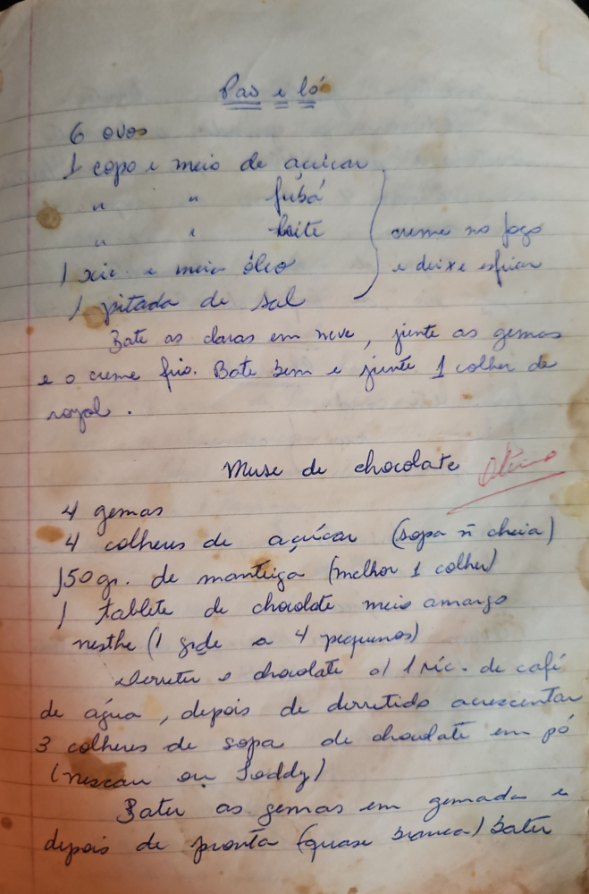

# Página 70
:::danger[NÃO REVISADO]
A página não foi revisada, portanto pode conter erros de digitação, formatação ou alucinações.
:::
## Pão e Ló

*   6 ovos
*   1 copo e meio de açucar
*   " " " " fubá
*   " " " " leite
*   1 xic. e meia óleo
*   1 pitada de sal

creme no fogo e deixe esfriar 

Bate as claras em neve, junte as gemas e o creme frio. Bate bem e junte 1 colher de royal.

## Muse de chocolate

*   4 gemas
*   4 colheres de açucar (sopa n cheia)
*   150 gr. de manteiga (melhor 1 colher)
*   1 tablete de chocolate meio amargo nestle (1 side a 4 pequenos)

derreter o chocolate c/ 1 xic. de café de água, depois de derretido acrescentar 3 colheres de sopa de chocolate em pó (nescau ou toddy)

Bater as gemas em gemada e depois de pronta (quase branca) bater...

