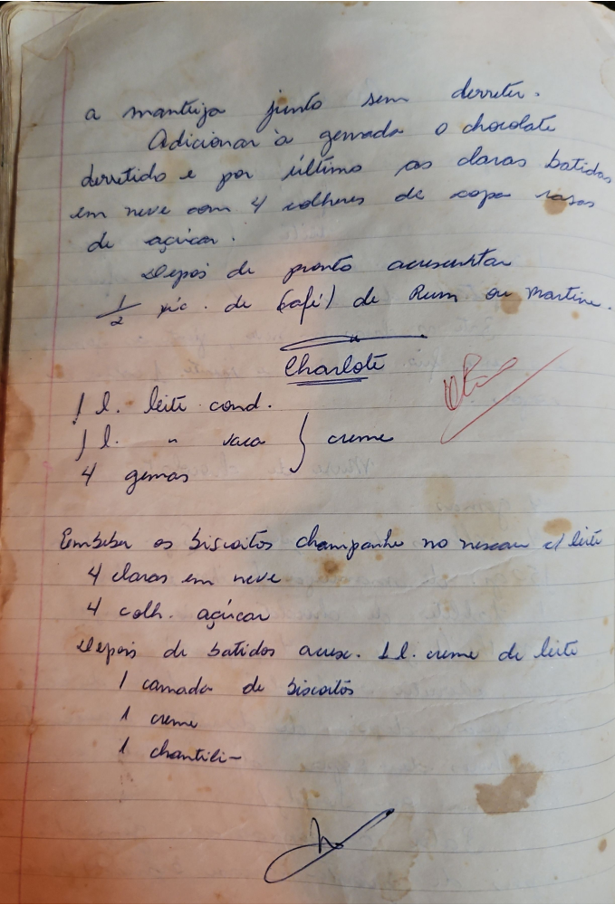

# Página 71
:::danger[NÃO REVISADO]
A página não foi revisada, portanto pode conter erros de digitação, formatação ou alucinações.
:::
## [Seção Não Nomeada / Receita Anterior]

a manteiga junto sem derreter.
Adicionar à gemada o chocolate
derretido e por ultimo as claras batidas
em neve com 4 colheres de sopa rasas
de açucar.
Depois de pronto acrecentar
½ xic. de bofil de Rum ou martini.

## Charlotte

### Creme
- 1 l. leite cond.
- 1 l. " saca
- 4 gemas
creme

### Montagem
- Embeber os biscoitos champanhe no rescau et leite

### Merengue
- 4 claras em neve
- 4 colh. açucar

### Finalização
- Depois de batidos aux. 1 l. creme de leite

### Camadas
- 1 camada de biscoitos
- 1 creme
- 1 chantili-

