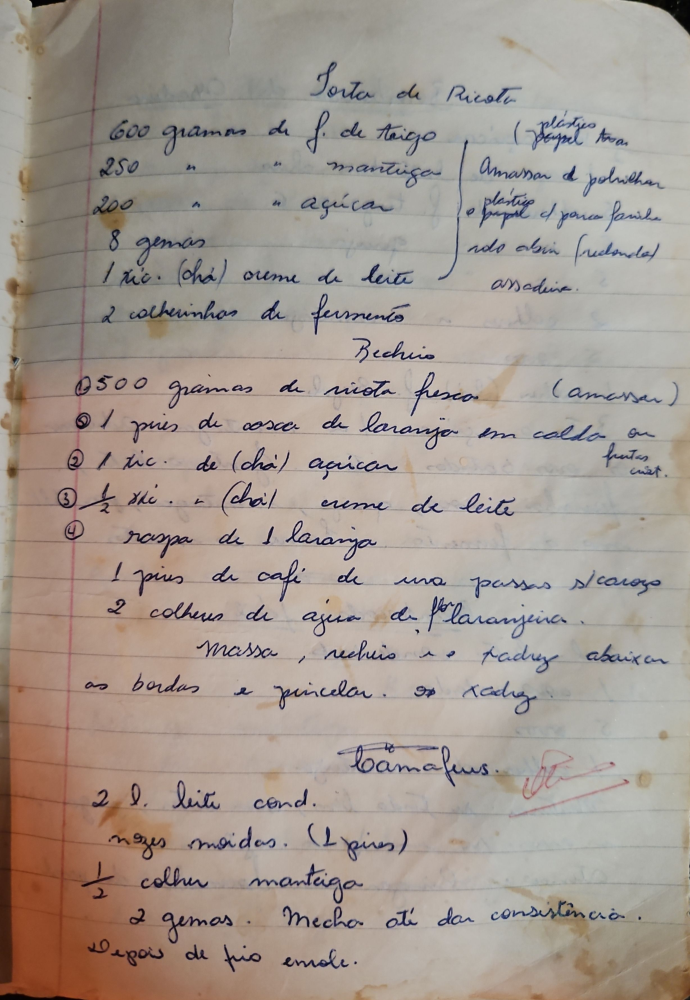

# Página 72
:::danger[NÃO REVISADO]
A página não foi revisada, portanto pode conter erros de digitação, formatação ou alucinações.
:::
## Torta de Ricota

- 600 gramas de f. de trigo
- 250 " " mantiga
- 200 " " açucar
- 8 gemas
- 1 xic. (chá) creme de leite
- 2 colherinhas de fermento

(plástico)
(papel)
(forma)

Amassar e polvilhar
o papel e a forma redonda
assobiar.

### Recheio

1.  500 gramas de ricota fresca (amassar)
2.  1 pires de casca de laranja em calda ou frutas cristal.
3.  1 xic. de (chá) açucar
4.  ½ xic. - (chá) creme de leite
5.  raspa de 1 laranja
- 1 pires de café de uva passas s/ caroço
- 2 colheres de agua de flor laranjeira.

Massa, recheio e pAdrez abaixo
as bordas e pincelar. x xadrez.

### Possivelmente Bamafus

- 2 l. leite cond.
- nozes moidas. (1 pires)
- ½ colher manteiga
- 2 gemas.
- Mexer até dar consistencia.
- Depois de frio enrola.

