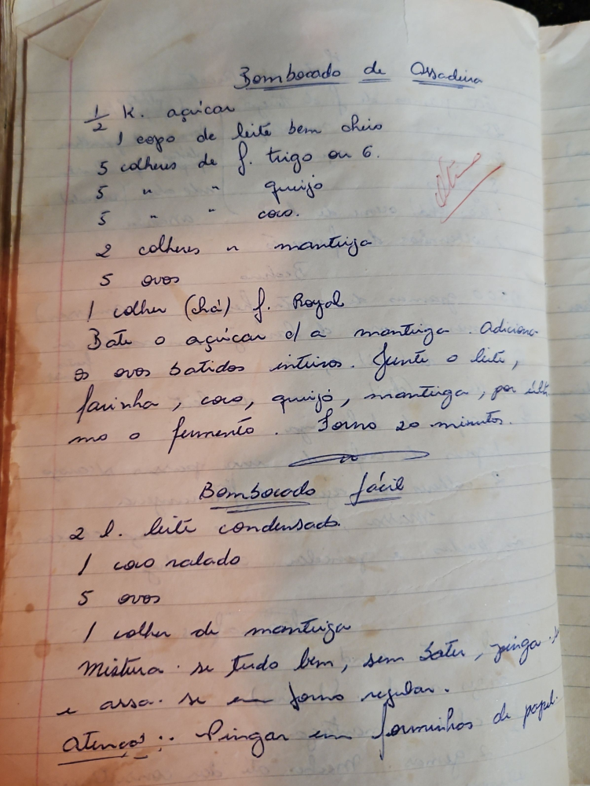

# Página 73
:::danger[NÃO REVISADO]
A página não foi revisada, portanto pode conter erros de digitação, formatação ou alucinações.
:::
## Bombocado de Assadeira

*   ½ K. açúcar
*   1 copo de leite bem cheio
*   5 colheres de f. trigo ou 6.
*   5 " " " quijo
*   5 " " " coco.
*   2 colheres " " manteiga
*   5 ovos
*   1 colher (chá) f. Royal

Bate o açúcar c/ a manteiga. Adiciona
os ovos batidos inteiros. Juncte o leite,
farinha, coco, quijo, manteiga, por ulti-
mo o fermento. Forno 20 minutos.

## Bombocado fácil

*   2 l. leite condensado
*   1 coco ralado
*   5 ovos
*   1 colher de manteiga

Mistura-se tudo bem, sem bater, pinga
e assa. se em forno regular.
Attenção:: Pingar em forminhos de papel.

