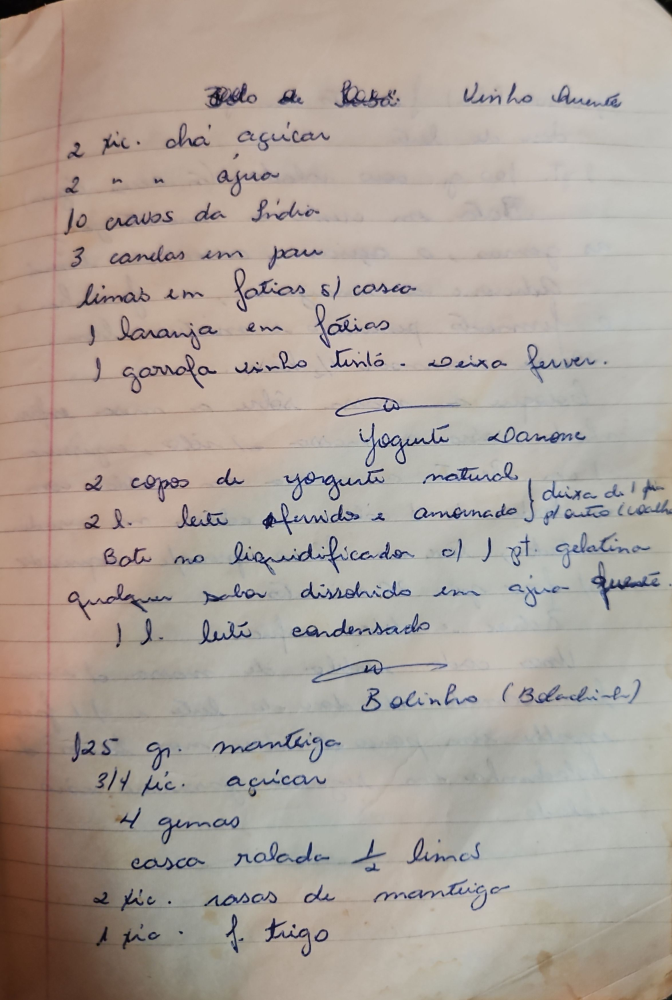

# Página 74
:::danger[NÃO REVISADO]
A página não foi revisada, portanto pode conter erros de digitação, formatação ou alucinações.
:::
## Bolo de Pão. Vinho Quente

* 2 tic. chá açucar
* 2 " " agua
* 10 cravos da India
* 3 canelas em pau
* limas em fatias s/ casca
* 1 laranja em fatias
* 1 garrafa vinho tinto - deixa ferver.

## Yogurte Danone

* 2 copos de yogurte natural
* 2 l. leite afervidos e amornado [texto ilegível na lateral]
* Bate no liquidificador o:
* ) 1 pt. gelatina qualquer sabor dissolvido em agua quente.
* 1 l. leite condensado

## Bolinho (Beladinho)

* 125 gr. manteiga
* 3/4 tic. açucar
* 4 gemas
* casca ralada 1/2 limão
* 2 tic. rasas de manteiga
* 1 tic. f. trigo

