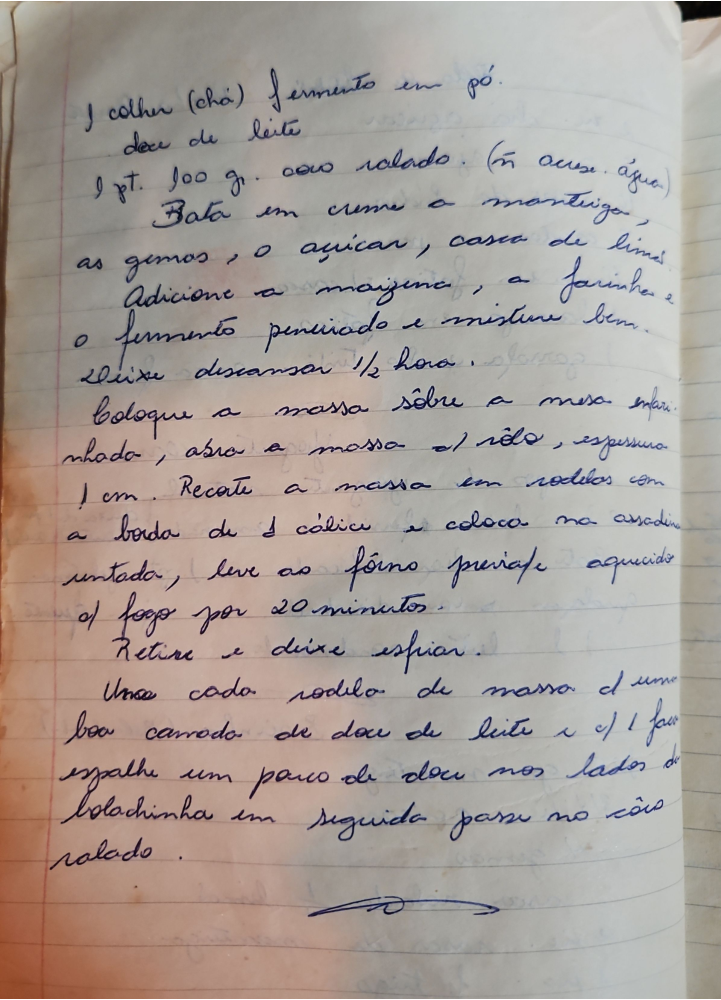

# Página 75
:::danger[NÃO REVISADO]
A página não foi revisada, portanto pode conter erros de digitação, formatação ou alucinações.
:::
## Bolachinhas de Doce de Leite e Coco

### Ingredientes

- 1 colher (chá) fermento em pó
- doce de leite
- 1 pote 100 gr. coco ralado. (não acrescente água)
- manteiga
- gemas
- açucar
- casca de limão
- maizena
- farinha

### Modo de Preparo

1. Bata em creme a manteiga.
2. Adicione as gemas, o açucar, casca de limão, a maizena, a farinha e o fermento peneirado e misture bem.
3. Deixe descansar 1/2 hora.
4. Coloque a massa sôbre a mesa enfarinhada, abra a massa ao rolo, espessura 1 cm.
5. Recorte a massa em rodelas com a borda de 1 cálice e coloque na assadeira untada, leve ao forno prévio aquecido ao fogo por 20 minutos.
6. Retire e deixe esfriar.
7. Unte cada rodela de massa de uma boa camada de doce de leite e com a faca espalhe um pouco de doce nos lados da bolachinha em seguida passe no côco ralado.

