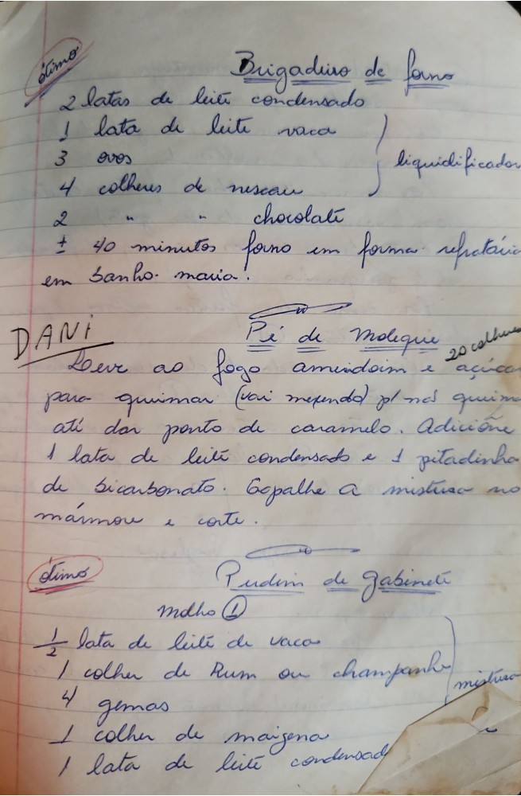

# Página 76
:::danger[NÃO REVISADO]
A página não foi revisada, portanto pode conter erros de digitação, formatação ou alucinações.
:::
## Brigadeiro de Forno
(Ótimo)

- 2 latas de leite condensado
- 1 lata de leite vaca
- 3 ovos
- 4 colheres de nescau
- 2 chocolate

(liquidificador)

$\pm$ 40 minutos forno em forma refratária em banho-maria!

## Pé de Moleque
(DANI)

Leve ao fogo amendoim e açúcar 20 colheres para queimar (vai mexendo) p/ não queimar até dar ponto de caramelo. Adicione 1 lata de leite condensado e 1 pitadinha de bicarbonato. Espalhe a mistura no mármore e corte.

## Pudim de gabinete
(Ótimo)

Mdlho ①

- ½ lata de leite de vacas
- 1 colher de Rum ou champanhe
- 4 gemas
- 1 colher de maizena
- 1 lata de leite condensado

(mistura)

