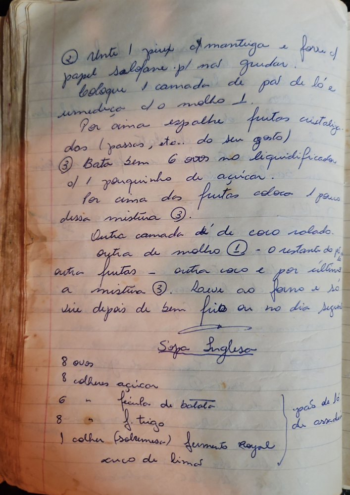

# Página 77
:::danger[NÃO REVISADO]
A página não foi revisada, portanto pode conter erros de digitação, formatação ou alucinações.
:::
## Sopa Inglesa

② Unte 1 pirex com manteiga e forre com papel salofane p[ara] não grudar. Coloque 1 camada de pão de ló e umedeca com o molho ①.

Por cima espalhe frutos cristalizados (passas, etc... do seu gosto)

③ Bata bem 6 ovos no liquidificador, com 1 pouquinho de açucar. Por cima dos frutos coloque 1 pouco dessa mistura ③.

Outra camada de coco ralado. Outra de molho ① - o restante do [molho]. Outra frutas - outra coco e por ultimo a mistura ③.

Leve ao forno e só sirva depois de bem frio ou no dia seguinte.

### Ingredientes (pão de ló de assadeira)

- 8 ovos
- 8 colheres açucar
- 6 colheres fécula de batata
- 8 colheres f. trigo
- 1 colher (sobremesa) fermento Royal
- suco de limão

