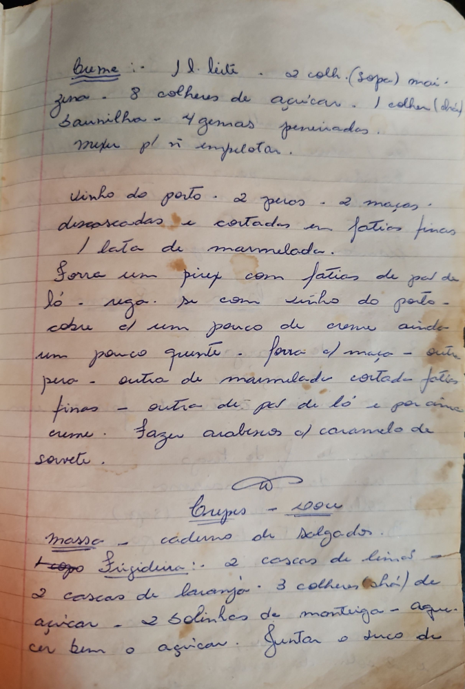

# Página 78
:::danger[NÃO REVISADO]
A página não foi revisada, portanto pode conter erros de digitação, formatação ou alucinações.
:::

## Creme

-   1 l. leite
-   2 colheres (sopa) mais
-   gema - 8 colheres de açúcar
-   1 colher (chá) Baunilha
-   4 gemas peneiradas.

Mexer para não empelotar.

### Vinho do Porto

-   2 peras
-   2 maçãs.
-   descascadas e cortadas em fatias finas
-   1 lata de marmelada.

Forrar um pirex com fatias de pão de
ló - rega-se com vinho do porto -
cobre com um pouco de creme ainda
um pouco quente - forra com maçã - outra
pera - outra de marmelada cortada em fatias
finas - outra de pão de ló e por cima
creme. Fazer arabescos com caramelo de
servir sorvete.

## Crepes - Doce

### Massa

-   caderno de Salgados. (Note: This seems like a reference)
-   1 Copo Liquidificador
-   2 cascas de limões
-   2 cascas de laranja
-   3 colheres (chá) de açúcar
-   2 bolinhas de manteiga
-   água.

Juntar o suco de
cer bem o açúcar.

