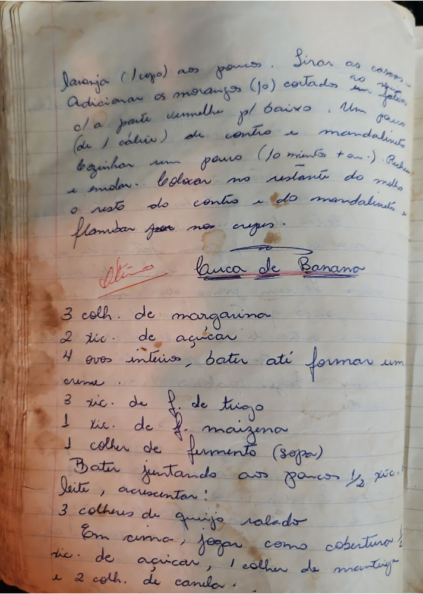

# Página 79
:::danger[NÃO REVISADO]
A página não foi revisada, portanto pode conter erros de digitação, formatação ou alucinações.
:::
Laranja (1 copo) aos poucos. Sirar as cascas.
Adicionar os morangos (10) cortados ao meio.
clara a parte branca pl baixo. Um pouso (de 1 cálice) de Contro e mandalineto
cozinhar um pouro (10 minutos + ou -). Puxa e mudar.
Colocar no restante do molho o resto do Contro e do mandalineto e
flambar por nos crepes.

## Broa de Banano

- 3 colh. de margarina
- 2 xic. de açúcar
- 4 ovos inteiros, bater até formar um creme.
- 3 xic. de f. de trigo
- 1 xic. de f. maizena
- 1 colher de fermento (sopa)
- Bater juntando aos poucos ½ xic. Leite, acrescentar:
- 3 colheres de queijo ralado
- Em cima, jogar como cobertura:
    - ½ xic. de açúcar
    - 1 colher de manteiga
    - e 2 colh. de canela.

