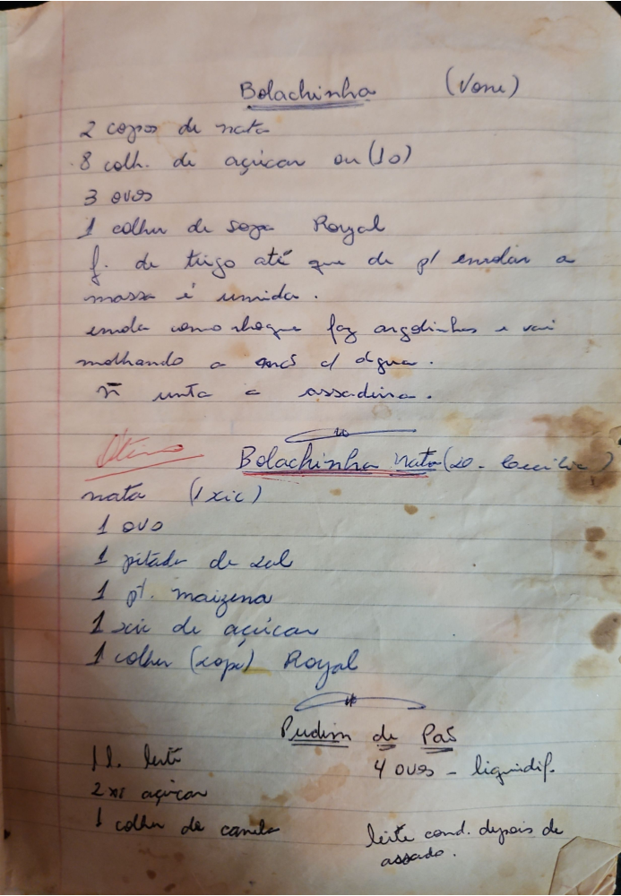

# Página 80
:::danger[NÃO REVISADO]
A página não foi revisada, portanto pode conter erros de digitação, formatação ou alucinações.
:::
## Bolachinha (Vani)

- 2 copos de nata
- 8 collh. de açucar ou (10)
- 3 ovos
- 1 collh de sopa Royal
- f. de trigo até que de p/ enrolar a massa é umida.

enrola como nhoque faz argolinhas e vai molhando a anós da água.
não unta a assadeira.

## Bolachinha nata (Co. Cecília)

- nata (1 xic)
- 1 ovo
- 1 pitada de sal
- 1 pt. maizena
- 1 xic de açucar
- 1 colher (sopa) Royal

## Pudim de Pão

- 1 L. leite
- 2 xic açucar
- 1 colher de canela
- 4 ovos - liquidif.
- leite cond. depois de assado.

