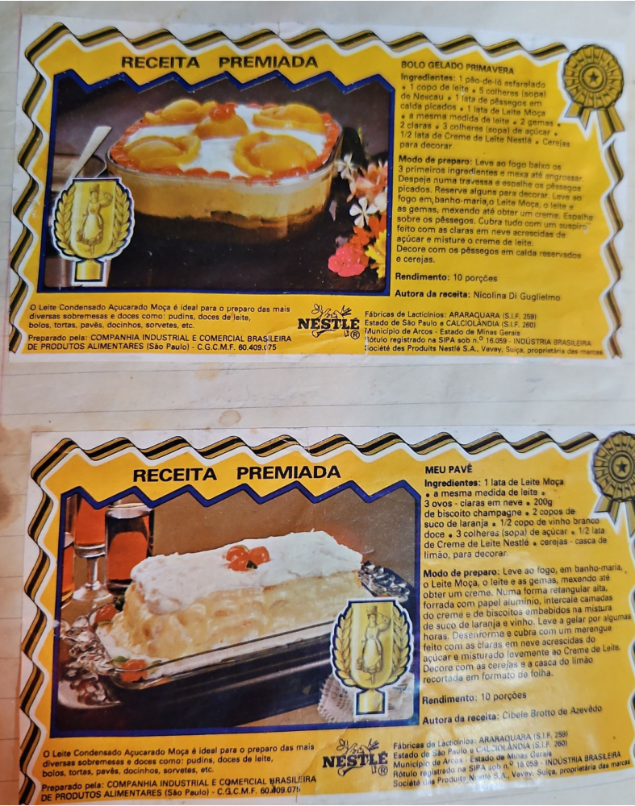

# Página 81
:::danger[NÃO REVISADO]
A página não foi revisada, portanto pode conter erros de digitação, formatação ou alucinações.
:::
REICEITA PREMIADA

## BOLO GELADO PRIMAVERA

### Ingredientes:
- 1 pão-de-ló esfarelado
- 1 copo de leite
- 5 colheres (sopa) de Nescau
- 1 lata de pêssegos em calda picados
- 1 lata de Leite Moça
- a mesma medida de leite
- 2 gemas
- 2 claras
- 3 colheres (sopa) de açúcar
- 1/2 lata de Creme de Leite Nestlé
- Cerejas para decorar

### Modo de preparo:
Leve ao fogo baixo os 3 primeiros ingredientes e mexa até engrossar. Despeje numa travessa e espalhe os pêssegos picados. Reserve alguns para decorar. Leve ao fogo em banho-maria o Leite Moça, o leite e as gemas, mexendo até obter um creme. Espalhe sobre os pêssegos. Cubra tudo com um suspiro feito com as claras em neve acrescidas de açúcar e misture o creme de leite. Decore com os pêssegos em calda reservados e cerejas.

### Rendimento:
10 porções

### Autora da receita:
Nicolina Di Guglielmo

---

REICEITA PREMIADA

## MEU PAVÊ

### Ingredientes:
- 1 lata de Leite Moça
- a mesma medida de leite
- 3 ovos - claras em neve
- 200g de biscoito champagne
- 2 copos de suco de laranja
- 1/2 copo de vinho branco doce
- 3 colheres (sopa) de açúcar
- 1/2 lata de Creme de Leite Nestlé
- cerejas - casca de limão, para decorar.

### Modo de preparo:
Leve ao fogo, em banho-maria, o Leite Moça, o leite e as gemas, mexendo até obter um creme. Numa forma retangular alta, forrada com papel alumínio, intercale camadas do creme e de biscoitos embebidos na mistura de suco de laranja e vinho. Leve a gelar por algumas horas. Desenforme e cubra com um merengue feito com as claras em neve acrescidas do açúcar e misturado levemente ao Creme de Leite. Decore com as cerejas e a casca do limão recortada em formato de folha.

### Rendimento:
10 porções

### Autora da receita:
Cibele Brotto de Azevedo

---

O Leite Condensado Açucarado Moça é ideal para o preparo das mais diversas sobremesas e doces como: pudins, doces de leite, bolos, tortas, pavês, docinhos, sorvetes, etc.
Preparado pela: COMPANHIA INDUSTRIAL E COMERCIAL BRASILEIRA DE PRODUTOS ALIMENTARES (São Paulo) - C.G.C.M.F. 60.409.(75)
Fábricas de Lacticínios: ARARAQUARA (S.I.F. 259) Estado de São Paulo e CALCIOLÂNDIA (S.I.F. 260) Município de Arcos - Estado de Minas Gerais
Rótulo registrado na SIPA sob n.º 16.059 - INDUSTRIA BRASILEIRA
Société des Produits Nestlé S.A., Vevey, Suíça, proprietária das marcas

