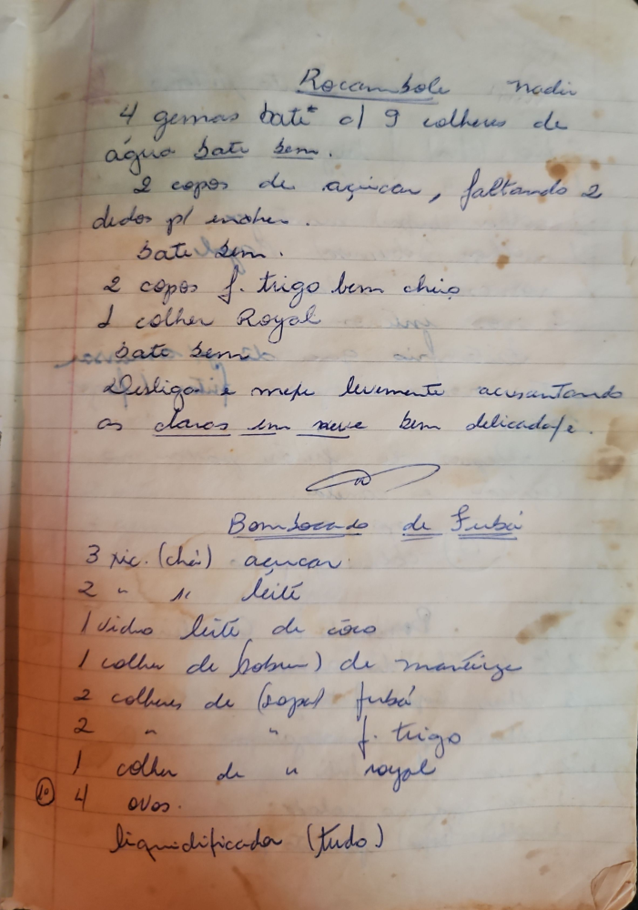

# Página 82
:::danger[NÃO REVISADO]
A página não foi revisada, portanto pode conter erros de digitação, formatação ou alucinações.
:::
## Rocambole

Nadir

- 4 gemas bate com 9 colheres de
- água bate bem.
- 2 copos de açúcar, faltando 2
- dedos p/ encher.
- bate bem.
- 2 copos f. trigo bem cheio
- 1 colher Royal
- bate bem.
- Desligar e mexer levemente acrescentando
- as claras em neve bem delicadade.

## Bombocado de Fubá

- 3 xic. (chá) açúcar.
- 2 " " leite
- 1 vidro leite de côco
- 1 colher de (sopa) de mantiga
- 2 colheres de (sopa) fubá
- 2 " " f. trigo
- 1 colher de " royal
- 4 ovos.
- liquificada (tudo)

