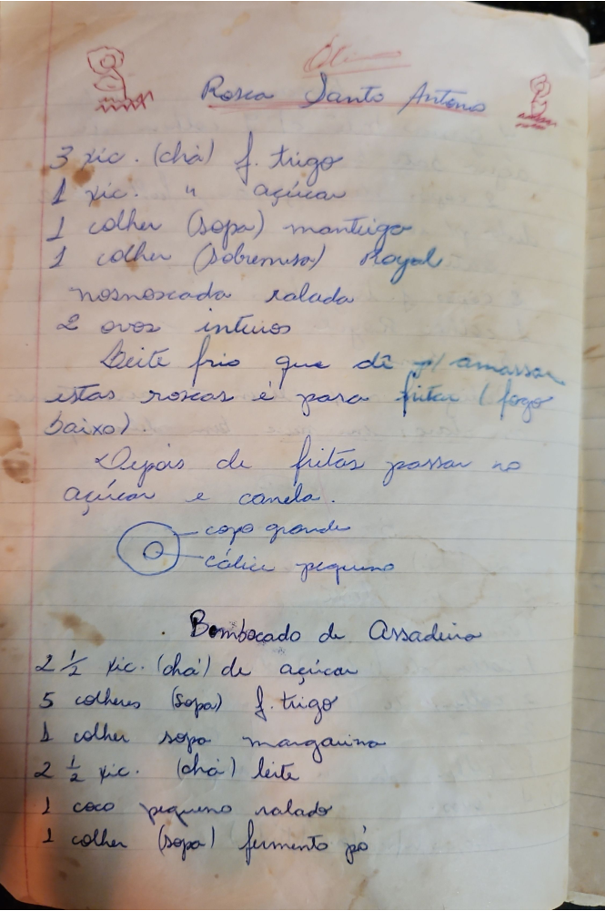

# Página 83
:::danger[NÃO REVISADO]
A página não foi revisada, portanto pode conter erros de digitação, formatação ou alucinações.
:::
## Rosca Santo Antonio

- 3 xíc. (chá) f. trigo
- 1 xíc. " açucar
- 1 colher (Sopa) manteiga
- 1 colher (Sobremesa) Royal
- nosmoscada ralada
- 2 ovos inteiros

Leite frio que dê p/ amassar estas roscas e para fritar (fogo baixo).
Depois de fritos passar no açúcar e canela.

O
O - copo grande
  - cálice pequeno

## Bombocado de Assadeira

- 2 ½ xíc. (chá) de açucar
- 5 colheres (Sopa) f. trigo
- 1 colher sopa margarina
- 2 ½ xíc. (chá) leite
- 1 coco pequeno ralado
- 1 colher (Sopa) fermento pó

