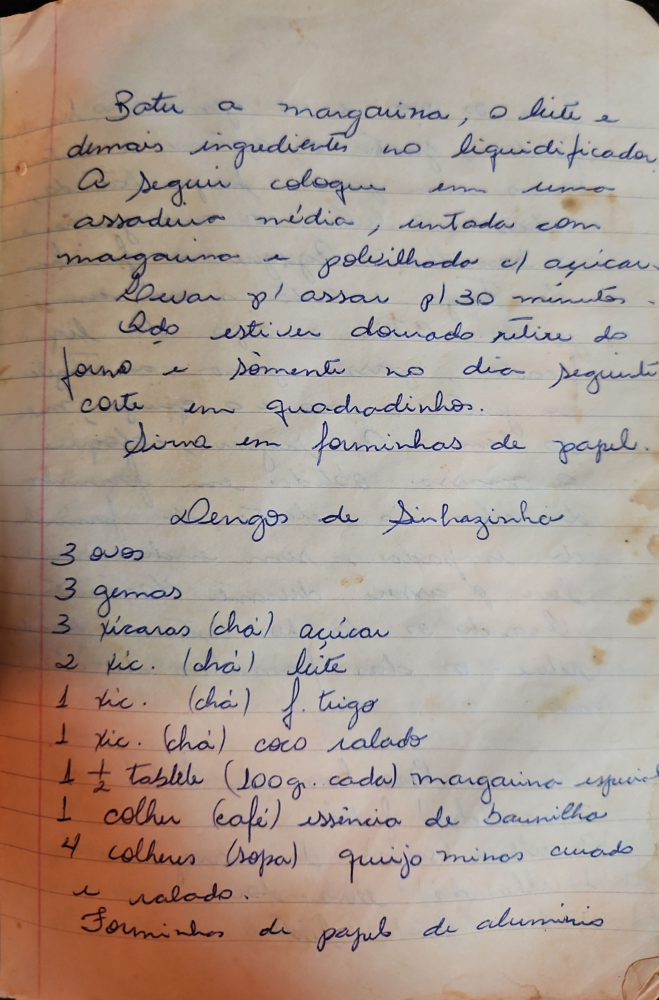

# Página 84
:::danger[NÃO REVISADO]
A página não foi revisada, portanto pode conter erros de digitação, formatação ou alucinações.
:::
## Lenços de Sinhazinha

### Modo de Preparo

Bater a margarina, o leite e demais ingredientes no liquidificador.
A seguir coloque em uma assadeira média, untada com margarina e polvilhado c/ açúcar.
Levar p/ assar p/ 30 minutos.
Quando estiver dourado retire do forno e somente no dia seguinte corte em quadradinhos.
Sirva em forminhas de papel.

### Ingredientes

*   3 ovos
*   3 gemas
*   3 xícaras (chá) açúcar
*   2 xíc. (chá) leite
*   1 xíc. (chá) f. trigo
*   1 xíc. (chá) coco ralado
*   1 ½ tablete (100g. cada) margarina especial
*   1 colher (café) essência de baunilha
*   4 colheres (sopa) queijo minas curado e ralado.

Forminhas de papel de alumínio

