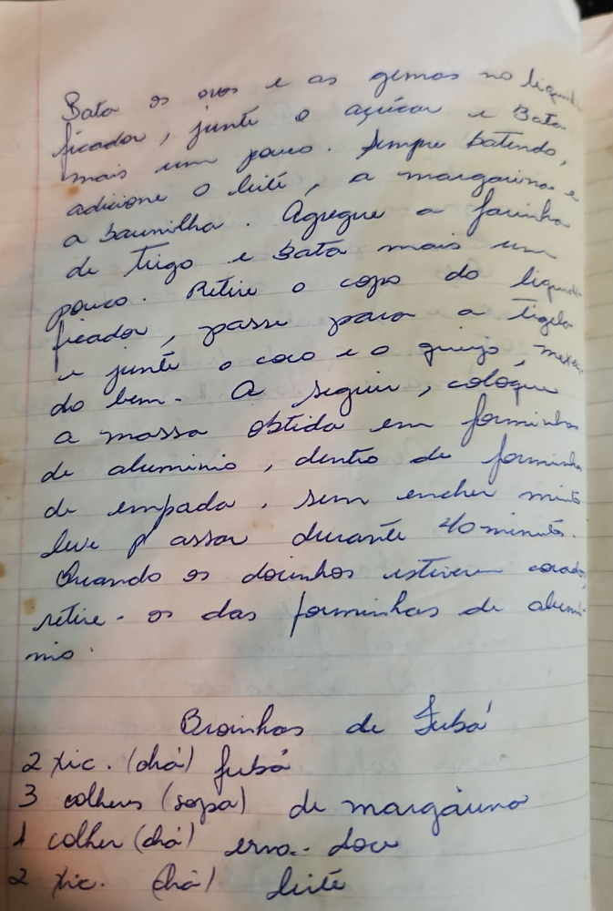

# Página 85
:::danger[NÃO REVISADO]
A página não foi revisada, portanto pode conter erros de digitação, formatação ou alucinações.
:::
Bata os ovos e as gemas no liquidificador, junte o açúcar e bata mais um pouco. Sempre batendo, adicione o leite, a margarina e a baunilha. Agregue a farinha de trigo e bata mais um pouco. Retire o copo do liquidificador, passe para a tigela e junte o coco e o queijo, mexendo bem. A seguir, coloque a massa obtida em forminhas de aluminio, dentro de forminhas de empada, sem encher muito. Leve p' assar durante 40 minutos. Quando os docinhos estiverem corados retire-os das forminhas de aluminio.

## Broinhas de Fubá

*   2 tic. (chá) fubá
*   3 colheres (sopa) de margarina
*   1 colher (chá) erva-doce
*   2 tic. (chá) leite

