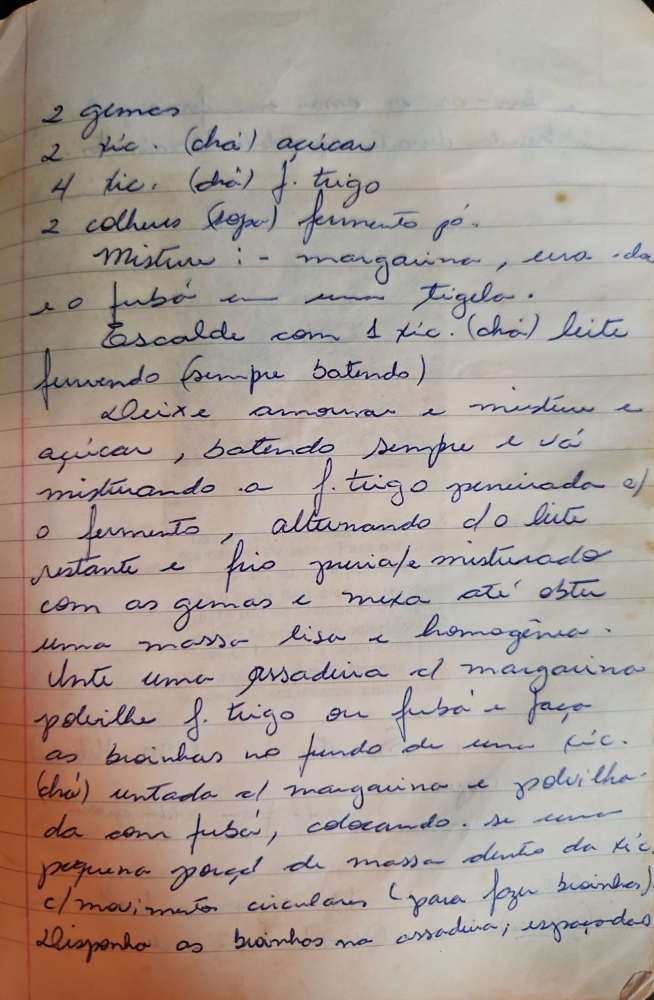

# Página 86
:::danger[NÃO REVISADO]
A página não foi revisada, portanto pode conter erros de digitação, formatação ou alucinações.
:::
## Receita

### Ingredientes:

*   2 gemas
*   2 xic. (chá) açúcar
*   4 xic. (chá) f. trigo
*   2 colheres (sopa) fermento pó.

### Preparo:

1.  Misture: margarina, uma da e o fubá em uma tigela.
2.  Escalde com 1 xic. (chá) leite fervendo (sempre batendo).
3.  Deixe amornar e misture o açúcar, batendo sempre e vá misturando a f. trigo peneirada e/ o fermento, alternando c/o leite restante e frio p/riafc misturado com as gemas e mexa até obter uma massa lisa e homogênea.
4.  Unte uma assadeira c/ margarina polvilhe f. trigo ou fubá.
5.  Faça as broinhas no fundo de uma xic. (chá) untada c/ margarina e polvilhada com fubá, colocando-se uma pequena porção de massa dentro da xic. c/ movimentos circulares (para fazer broinhas).
6.  Disponha as broinhas na assadeira; espaçadas.

