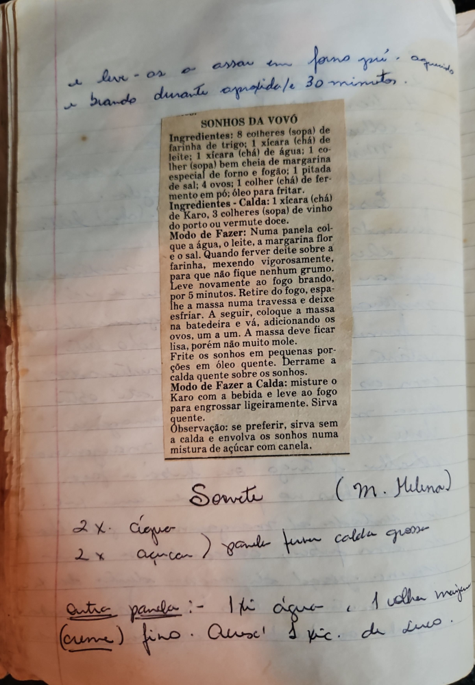

# Página 87
:::danger[NÃO REVISADO]
A página não foi revisada, portanto pode conter erros de digitação, formatação ou alucinações.
:::
## SONHOS DA VOVÓ

### Ingredientes:
*   8 colheres (sopa) de farinha de trigo;
*   1 xícara (chá) de leite;
*   1 xícara (chá) de água;
*   1 colher (sopa) bem cheia de margarina especial de forno e fogão;
*   1 pitada de sal;
*   4 ovos;
*   1 colher (chá) de fermento em pó;
*   óleo para fritar.

### Ingredientes - Calda:
*   1 xícara (chá) de Karo;
*   3 colheres (sopa) de vinho do porto ou vermute doce.

### Modo de Fazer:
1.  Numa panela coloque a água, o leite, a margarina e o sal.
2.  Quando ferver deite sobre a farinha, mexendo vigorosamente, para que não fique nenhum grumo.
3.  Leve novamente ao fogo brando, por 5 minutos.
4.  Retire do fogo, espalhe a massa numa travessa e deixe esfriar.
5.  A seguir, coloque a massa na batedeira e vá, adicionando os ovos, um a um.
6.  A massa deve ficar lisa, porém não muito mole.
7.  Frite os sonhos em pequenas porções em óleo quente.
8.  Derrame a calda quente sobre os sonhos.

### Modo de Fazer a Calda:
1.  Misture o Karo com a bebida e leve ao fogo para engrossar ligeiramente.
2.  Sirva quente.

**Observação:** se preferir, sirva sem a calda e envolva os sonhos numa mistura de açúcar com canela.

(M. Helina)

## Sorvete

2 x. água )
2 x. açúcar )
Outra panela :- 1 xíc. água. 1 colher majusena (creme) fino. Avoca! 1 xíc. de suco.

