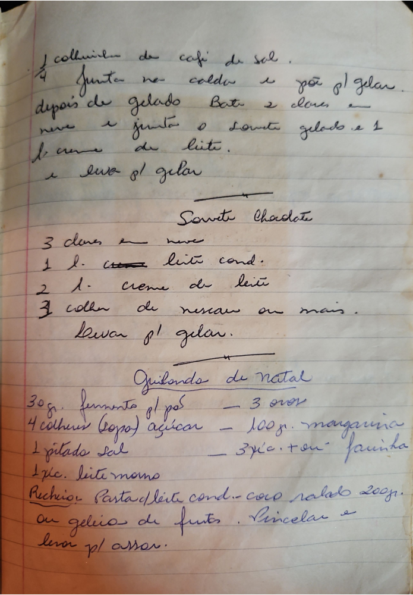

# Página 88
:::danger[NÃO REVISADO]
A página não foi revisada, portanto pode conter erros de digitação, formatação ou alucinações.
:::
## [Receita 1]

*   colherinha de cafe de sal.
*   Junta no caldo e poe p/ gelar.
*   depois de gelado Bate 2 claros em neve e junta o sorvete gelado e 1 lata de leite.
*   e levar p/ gelar.

## Sorvete Chadote

*   3 claras em neve
*   1 lata leite cond.
*   2 lata creme de leite
*   3 colher de nescau ou mais.
*   Levar p/ gelar.

## Guirlanda de Natal

*   30gr. fermento p/ pão - 3 ovos
*   4 colher (sopa) açúcar - 100gr. margarina
*   1 pitada sal - 3 xíc. + ou - farinha
*   1 xíc. leite morno
*   Recheio: Pasta de leite cond. + coco ralado 200gr. ou geleia de frutas.
*   Pincelar e levar p/ assar.

