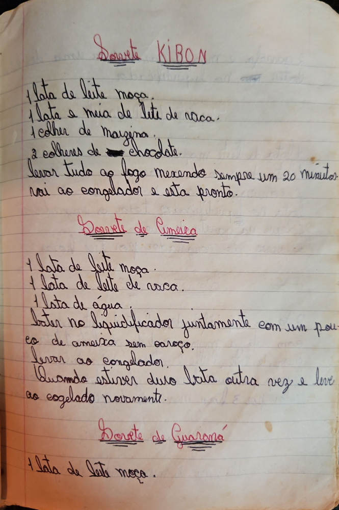

# Página 89
:::danger[NÃO REVISADO]
A página não foi revisada, portanto pode conter erros de digitação, formatação ou alucinações.
:::
## Sorvete KIBON

*   1 lata de leite moça.
*   1 lata e meia de leite de vaca.
*   1 colher de maisena.
*   2 colheres de chocolate.

Levar tudo ao fogo mexendo sempre um 20 minutos.
Vai ao congelador e está pronto.

## Sorvete de Ameixa

*   1 lata de leite moça.
*   1 lata de leite de vaca.
*   1 lata de água.

Bater no liquidificador juntamente com um pouco de ameixa sem caroço.
Levar ao congelador.
Quando estiver duro bata outra vez e leve ao congelador novamente.

## Sorvete de Guarana

*   1 lata de leite moça.

