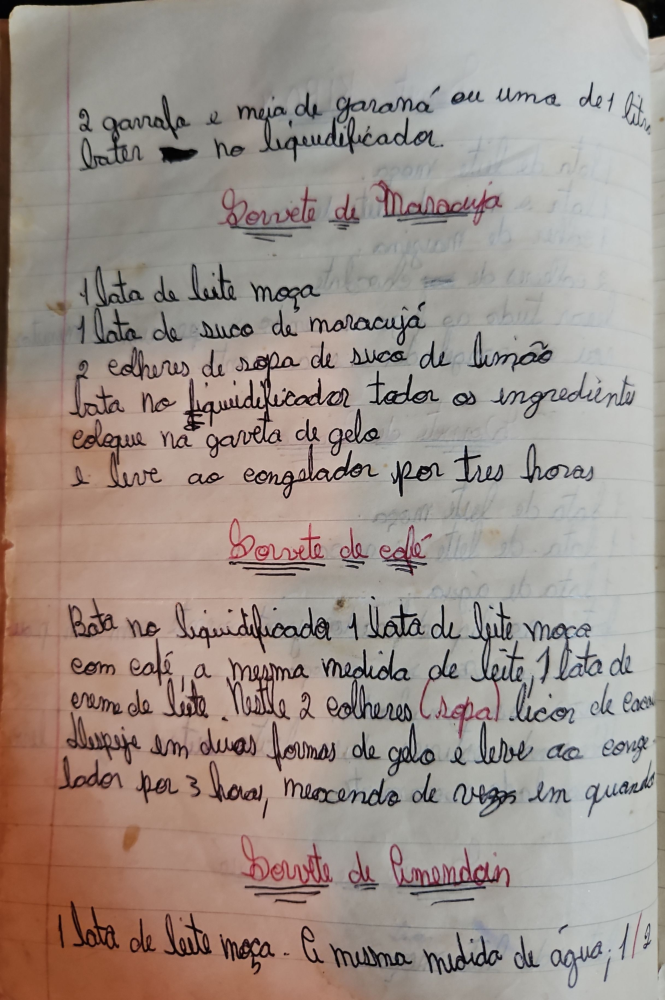

# Página 90
:::danger[NÃO REVISADO]
A página não foi revisada, portanto pode conter erros de digitação, formatação ou alucinações.
:::
2 garrafa e meia de garaná ou uma de 1 Litre
bater no liquidificador

## Sorvete de Maracujá
- 1 lata de leite moça
- 1 lata de suco de maracujá
- 2 colheres de sopa de suco de limão
- bata no liquidificador todos os ingredientes
- coloque na gaveta de gelo
- e leve ao congelador por três horas

## Sorvete de Café
- Bata no liquidificador 1 lata de leite moça
- com café a mesma medida de leite,
- 1 lata de creme de leite.
- Nestle 2 colheres (sopa) licor de cacau.
- Despeje em duas formas de gelo e leve ao congelador por 3 horas, mexendo de vezes em quando

## Sorvete de Amendoim
- 1 lata de leite moça - A mesma medida de água;
- 1/2

