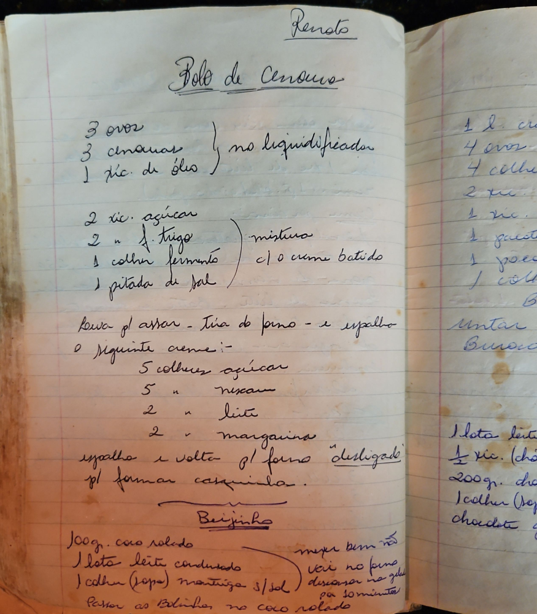

# Página 100
:::danger[NÃO REVISADO]
A página não foi revisada, portanto pode conter erros de digitação, formatação ou alucinações.
:::
Renato

## Bolo de Cenoura

- 3 ovos
- 3 cenouras
- 1 xíc. de óleo
} no liquidificador

- 2 xíc. açúcar
- 2 " f. trigo
- 1 colher fermento
- 1 pitada de sal
} mistura c/ o creme batido

- Leva p/ assar
- Tira do forno
- e espalho o seguinte creme:-

### Creme

- 5 colheres açúcar
- 5 " nescau
- 2 " leite
- 2 " margarina

- espalho e volta p/ forno "desligado" p/ formar casquinha.

## Beijinho

### Ingredientes

- 100gr. coco ralado
- 1 lata leite condensado
- 1 colher (sopa) manteiga s/ sal

### Modo de Preparo

- mexer bem
- vai no fogo
- Passar as bolinhas no coco ralado
- descansa na geladeira por 10 minutos

