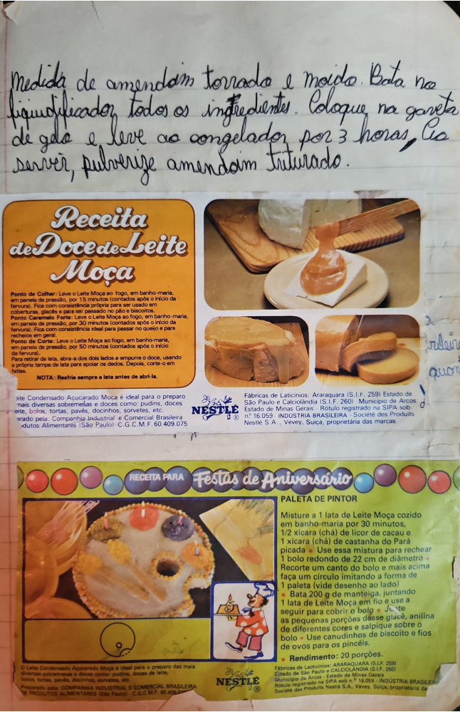

# Página 91
:::danger[NÃO REVISADO]
A página não foi revisada, portanto pode conter erros de digitação, formatação ou alucinações.
:::
## Receita Caseira (Amendoim)

Medida de amendoim torrado e moído. Bata no liquidificador todos os ingredientes. Coloque na gaveta de gelo e leve ao congelador por 3 horas. Para servir, pulverize amendoim triturado.

## Receita de Doce de Leite Moça

*   **Ponto de Colher:** Leve o Leite Moça ao fogo, em banho-maria, em panela de pressão, por 15 minutos (contados após o início da fervura). Fica com consistência ideal para ser usado em coberturas, glacês e para ser passado no pão e biscoito.
*   **Ponto Caramelo Forte:** Leve o Leite Moça ao fogo, em banho-maria, em panela de pressão, por 30 minutos (contados após o início da fervura). Fica com consistência ideal para passar no queijo e para recheios em geral.
*   **Ponto de Corte:** Leve o Leite Moça ao fogo, em banho-maria, em panela de pressão, por 50 minutos (contados após o início da fervura). Para retirar da lata, abra-a dos dois lados e empurre o doce, usando a própria tampa da lata para apoiar os dedos. Depois, corte-o em fatias.

Nota: Resfrie sempre a lata antes de abri-la.

## Informações Leite Condensado Moça

Leite Condensado Açucarado Moça é ideal para o preparo mais diversas sobremesas e doces como: pudins, doces de leite, bolos, tortas, pavês, docinhos, sorvetes, etc. Preparado pela COMPANHIA INDUSTRIAL E COMERCIAL BRASILEIRA DE PRODUTOS ALIMENTARES (São Paulo) - C.G.C.M.F. 60.409.075

Fábricas de Laticínios: Araraquara (S.I.F. 259) Estado de São Paulo e Calciolândia (S.I.F. 260) Município de Arcos Estado de Minas Gerais - Rótulo registrado na SIPA sob n° 16.059 INDÚSTRIA BRASILEIRA - Société des Produits Nestlé S.A., Vevey, Suíça, proprietária das marcas.

## Receita para Festas de Aniversário

### PALETA DE PINTOR

*   Misture 1 lata de Leite Moça cozido em banho-maria por 30 minutos, 1/2 xícara (chá) de licor de cacau e 1 xícara (chá) de castanha do Pará picada. Use essa mistura para rechear 1 bolo redondo de 22 cm de diâmetro.
*   Recorte um canto do bolo e mais acima faça um círculo imitando a forma de 1 paleta (vide desenho ao lado).
*   Bata 200 g de manteiga, juntando 1 lata de Leite Moça em fio e use a seguir para cobrir o bolo.
*   Junte as pequenas porções desse glacê, anilina de diferentes cores e salpique sobre o bolo.
*   Use canudinhos de biscoito e fios de ovos para os pincéis.

Rendimento: 20 porções.

