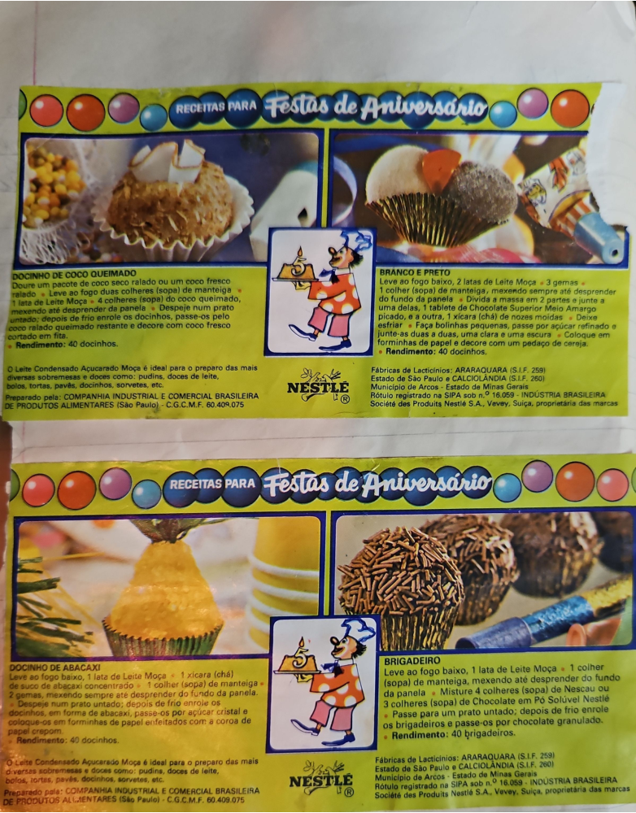

# Página 92
:::danger[NÃO REVISADO]
A página não foi revisada, portanto pode conter erros de digitação, formatação ou alucinações.
:::
## RECEITAS PARA Festas de Aniversário

### DOCINHO DE COCO QUEIMADO
*   Doure um pacote de coco seco ralado ou um coco fresco ralado.
*   Leve ao fogo duas colheres (sopa) de manteiga e 1 lata de Leite Moça.
*   Junte 4 colheres (sopa) do coco queimado, mexendo até desprender da panela.
*   Despeje num prato untado; depois de frio enrole os docinhos, passe-os pelo coco ralado queimado restante e decore com coco fresco cortado em fita.
*   **Rendimento:** 40 docinhos.

O Leite Condensado Açucarado Moça é ideal para o preparo das mais diversas sobremesas e doces como: pudins, doces de leite, bolos, tortas, pavês, docinhos, sorvetes, etc.
Preparado pela: COMPANHIA INDUSTRIAL E COMERCIAL BRASILEIRA DE PRODUTOS ALIMENTARES (São Paulo) - C.G.C.M.F. 60.409.075

### BRANCO E PRETO
*   Leve ao fogo baixo, 2 latas de Leite Moça e 3 gemas.
*   1 colher (sopa) de manteiga, mexendo sempre até desprender do fundo da panela.
*   Divida a massa em 2 partes e junte a uma delas, 1 tablete de Chocolate Superior Meio Amargo picado, e a outra, 1 xícara (chá) de nozes moídas.
*   Deixe esfriar.
*   Faça bolinhas pequenas, passe por açúcar cristal e junte-as duas a duas, uma clara e uma escura.
*   Coloque em forminhas de papel e decore com um pedaço de cereja.
*   **Rendimento:** 40 docinhos.

Fábricas de Lacticínios: ARARAQUARA (S.I.F. 259) Estado de São Paulo e CALCIOLÂNDIA (S.I.F. 260) Município de Arcos - Estado de Minas Gerais.
Rótulo registrado na SIPA sob n.º 16.059 - INDÚSTRIA BRASILEIRA
Société des Produits Nestlé S.A., Vevey, Suíça, proprietária das marcas.

### DOCINHO DE ABACAXI
*   Leve ao fogo baixo, 1 lata de Leite Moça, 1 xícara (chá) de suco de abacaxi concentrado e 1 colher (sopa) de manteiga e 2 gemas, mexendo sempre até desprender do fundo da panela.
*   Despeje num prato untado; depois de frio enrole os docinhos, em forma de abacaxi, passe-os por açúcar cristal e coloque-os em forminhas de papel enfeitados com a coroa de papel crepom.
*   **Rendimento:** 40 docinhos.

O Leite Condensado Açucarado Moça é ideal para o preparo das mais diversas sobremesas e doces como: pudins, doces de leite, bolos, tortas, pavês, docinhos, sorvetes, etc.
Preparado pela: COMPANHIA INDUSTRIAL E COMERCIAL BRASILEIRA DE PRODUTOS ALIMENTARES (São Paulo) - C.G.C.M.F. 60.409.075

### BRIGADEIRO
*   Leve ao fogo baixo, 1 lata de Leite Moça e 1 colher (sopa) de manteiga, mexendo até desprender do fundo da panela.
*   Misture 4 colheres (sopa) de Nescau ou 3 colheres (sopa) de Chocolate em Pó Solúvel Nestlé.
*   Passe para um prato untado; depois de frio enrole os brigadeiros e passe-os por chocolate granulado.
*   **Rendimento:** 40 brigadeiros.

Fábricas de Lacticínios: ARARAQUARA (S.I.F. 259) Estado de São Paulo e CALCIOLÂNDIA (S.I.F. 260) Município de Arcos - Estado de Minas Gerais.
Rótulo registrado na SIPA sob n.º 16.059 - INDÚSTRIA BRASILEIRA
Société des Produits Nestlé S.A., Vevey, Suíça, proprietária das marcas.

