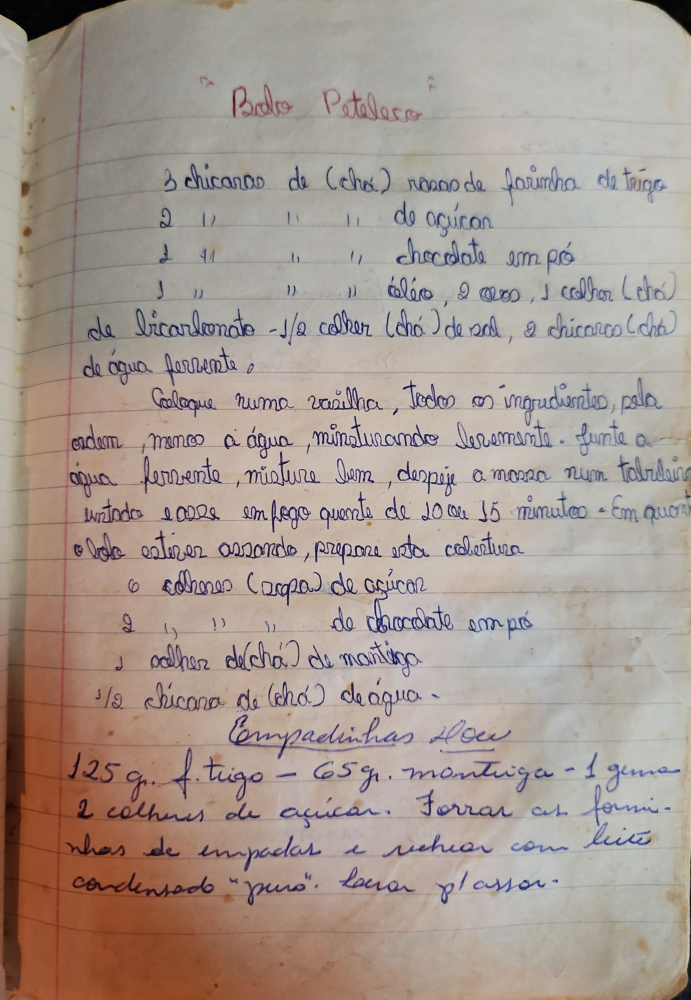

# Página 93
:::danger[NÃO REVISADO]
A página não foi revisada, portanto pode conter erros de digitação, formatação ou alucinações.
:::
## Bolo Petelesco

*   3 xícaras de (chá) rasas de farinha de trigo
*   2 " " " " de açúcar
*   2 " " " " chocolate em pó
*   1 " " " " óleo, 2 ovos, 1 colher (chá) de bicarbonato
*   1/2 colher (chá) de sal
*   2 xícaras (chá) de água fervente

Coloque numa vasilha, todos os ingredientes, pela ordem, menos a água, misturando levemente. Junte a água fervente, misture bem, despeje a massa num tabuleiro untado e polvilhado, em fogo quente de 20 ou 25 minutos - Em quanto o bolo estiver assando, prepare esta cobertura

*   6 colheres (sopa) de açúcar
*   2 " " " de chocolate em pó
*   1 colher de (chá) de manteiga
*   1/2 xícara de (chá) de água -

## Empadinhas Doce

125 g. f. trigo - 65 g. manteiga - 1 gema - 2 colheres de açúcar. Forrar as forminhas de empadas e rechear com leite condensado "puro". Levar p'assar.

