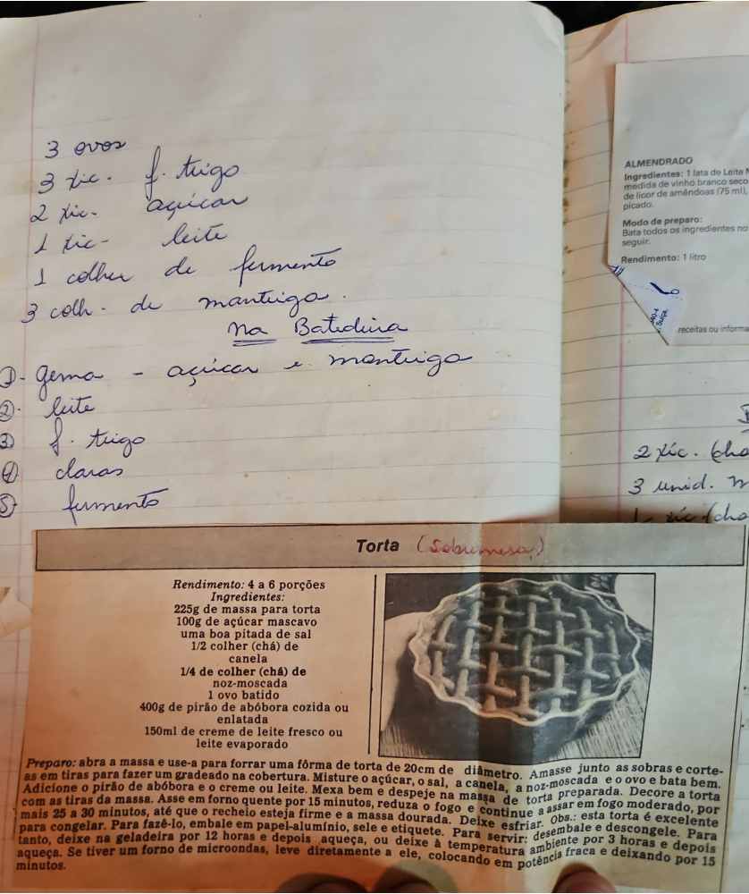

# Página 94
:::danger[NÃO REVISADO]
A página não foi revisada, portanto pode conter erros de digitação, formatação ou alucinações.
:::
## Bolo/Massa (Handwritten)

### Ingredientes

*   3 ovos
*   3 xic. f. trigo
*   2 xic. açúcar
*   1 xic. leite
*   1 colher de fermento
*   3 colh. de manteiga

### Método

Na Batidura:
1.  Gema - açúcar e manteiga
2.  Leite
3.  f. trigo
4.  claras
5.  fermento

## ALMENDRADO (Printed)

### Ingredientes

*   1 lata de Leite Moça
*   A mesma medida de vinho branco seco
*   1/2 dose de licor de amêndoas (75 ml), ou amêndoas picado.

### Modo de preparo

Bata todos os ingredientes no liquidificador ou batedeira e sirva a seguir.

### Rendimento

1 litro

## Notas (Handwritten)

*   2 xic. [unreadable word]
*   3 unid. [unreadable word]
*   1/2 xic. [unreadable word]

## Torta (Sobremesa) (Printed)

### Rendimento

4 a 6 porções

### Ingredientes

*   225g de massa para torta
*   100g de açúcar mascavo
*   uma boa pitada de sal
*   1/2 colher (chá) de canela
*   1/4 de colher (chá) de noz-moscada
*   1 ovo batido
*   400g de pirão de abóbora cozida ou enlatada
*   150ml de creme de leite fresco ou leite evaporado

### Preparo

Preparo: abra a massa e use-a para forrar uma fôrma de torta de 20cm de diâmetro. Amasse junto as sobras e corte-as em tiras para fazer um gradeado na cobertura. Misture o açúcar, o sal, a canela, a noz-moscada, o ovo e bata bem. Adicione o pirão de abóbora e o creme ou leite. Mexa bem e despeje na massa de torta preparada. Decore a torta com as tiras de massa. Asse em forno quente por 15 minutos, reduza o fogo e continue a assar em fogo moderado, por mais 25 a 30 minutos, até que o recheio esteja firme e a massa dourada. Deixe esfriar. Obs.: esta torta é excelente para congelar. Para fazê-lo, embale em papel-alumínio, sele e etiquette. Para servir: desembale e descongele. Para tanto, deixe na geladeira por 12 horas e depois aqueça, ou deixe à temperatura ambiente por 3 horas e depois aqueça. Se tiver um forno de microondas, leve diretamente a ele, colocando em potência fraca e deixando por 15 minutos.

