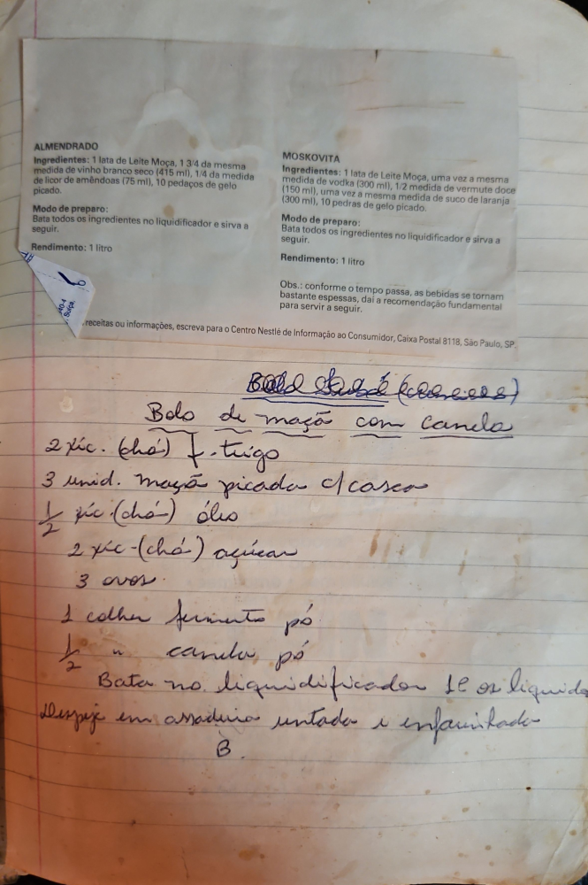

# Página 95
:::danger[NÃO REVISADO]
A página não foi revisada, portanto pode conter erros de digitação, formatação ou alucinações.
:::

## ALMENDRADO

**Ingredientes:**
*   1 lata de Leite Moça
*   1 3/4 da mesma medida de vinho branco seco (415 ml)
*   1/4 da medida de licor de amêndoas (75 ml)
*   10 pedaços de gelo picado.

**Modo de preparo:**
Bata todos os ingredientes no liquidificador e sirva a seguir.

**Rendimento:** 1 litro

---

## MOSKOVITA

**Ingredientes:**
*   1 lata de Leite Moça
*   uma vez a mesma medida de vodka (300 ml)
*   1/2 medida de vermute doce (150 ml)
*   uma vez a mesma medida de suco de laranja (300 ml)
*   10 pedras de gelo picado.

**Modo de preparo:**
Bata todos os ingredientes no liquidificador e sirva a seguir.

**Rendimento:** 1 litro

Obs.: conforme o tempo passa, as bebidas se tornam bastante espessas, daí a recomendação fundamental para servir a seguir.

Para receitas ou informações, escreva para o Centro Nestlé de Informação ao Consumidor, Caixa Postal 8118, São Paulo, SP.

---

## Bolo de maçã com canela

*   2 xíc. (chá) f. trigo
*   3 unid. maçã picada c/ casca
*   ½ xíc (chá) óleo
*   2 xíc (chá) açúcar
*   3 ovos
*   1 colher fermento pó
*   ½ " canela pó

Bata no liquidificador SÓ os líquidos
Despeje em assadeira untada e enfarinhada
B

