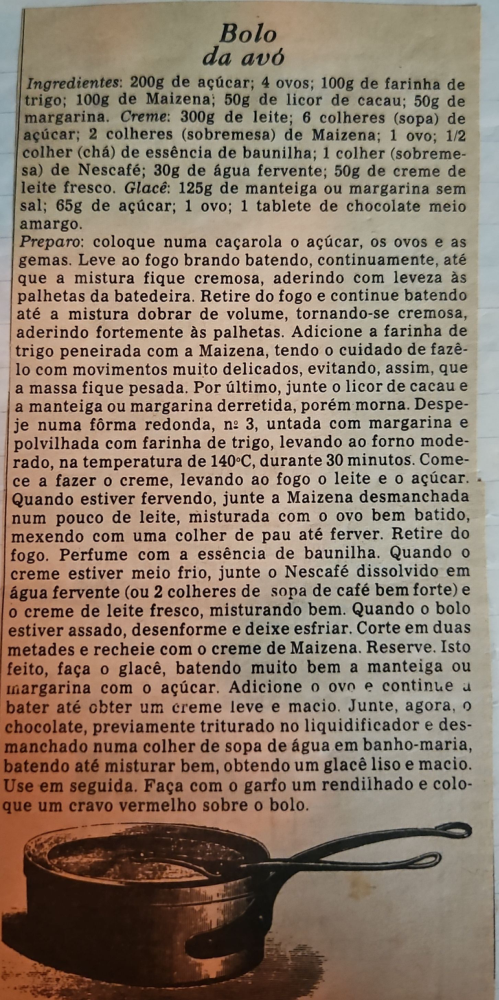

# Página 96
:::danger[NÃO REVISADO]
A página não foi revisada, portanto pode conter erros de digitação, formatação ou alucinações.
:::
## Bolo da avó

### Ingredientes:
- 200g de açúcar;
- 4 ovos;
- 100g de farinha de trigo;
- 100g de Maizena;
- 50g de licor de cacau;
- 50g de margarina.

### Creme:
- 300g de leite;
- 6 colheres (sopa) de açúcar;
- 2 colheres (sobremesa) de Maizena;
- 1 ovo;
- 1/2 colher (chá) de essência de baunilha;
- 1 colher (sobremesa) de Nescafé;
- 30g de água fervente;
- 50g de creme de leite fresco.

### Glacé:
- 125g de manteiga ou margarina sem sal;
- 65g de açúcar;
- 1 ovo;
- 1 tablete de chocolate meio amargo.

### Preparo:
- coloque numa caçarola o açúcar, os ovos e as gemas. Leve ao fogo brando batendo, continuamente, até que a mistura fique cremosa, aderindo com leveza às palhetas da batedeira.
- Retire do fogo e continue batendo até a mistura dobrar de volume, tornando-se cremosa, aderindo fortemente às palhetas.
- Adicione a farinha de trigo peneirada com a Maizena, tendo o cuidado de fazê-lo com movimentos muito delicados, evitando, assim, que a massa fique pesada.
- Por último, junte o licor de cacau e a manteiga ou margarina derretida, porém morna.
- Despeje numa fôrma redonda, nº 3, untada com margarina e polvilhada com farinha de trigo, levando ao forno moderado, na temperatura de 140°C, durante 30 minutos.
- Comece a fazer o creme, levando ao fogo o leite e o açúcar.
- Quando estiver fervendo, junte a Maizena desmanchada num pouco de leite, misturada com o ovo bem batido, mexendo com uma colher de pau até ferver.
- Retire do fogo.
- Perfume com a essência de baunilha.
- Quando o creme estiver meio frio, junte o Nescafé dissolvido em água fervente (ou 2 colheres de sopa de café bem forte) e o creme de leite fresco, misturando bem.
- Quando o bolo estiver assado, desenforme e deixe esfriar.
- Corte em duas metades e recheie com o creme de Maizena.
- Reserve.
- Isto feito, faça o glacé, batendo muito bem a manteiga ou margarina com o açúcar.
- Adicione o ovo e continue a bater até obter um creme leve e macio.
- Junte, agora, o chocolate, previamente triturado no liquidificador e desmanchado numa colher de sopa de água em banho-maria, batendo até misturar bem, obtendo um glacé liso e macio.
- Use em seguida.
- Faça com o garfo um rendilhado e coloque um cravo vermelho sobre o bolo.

