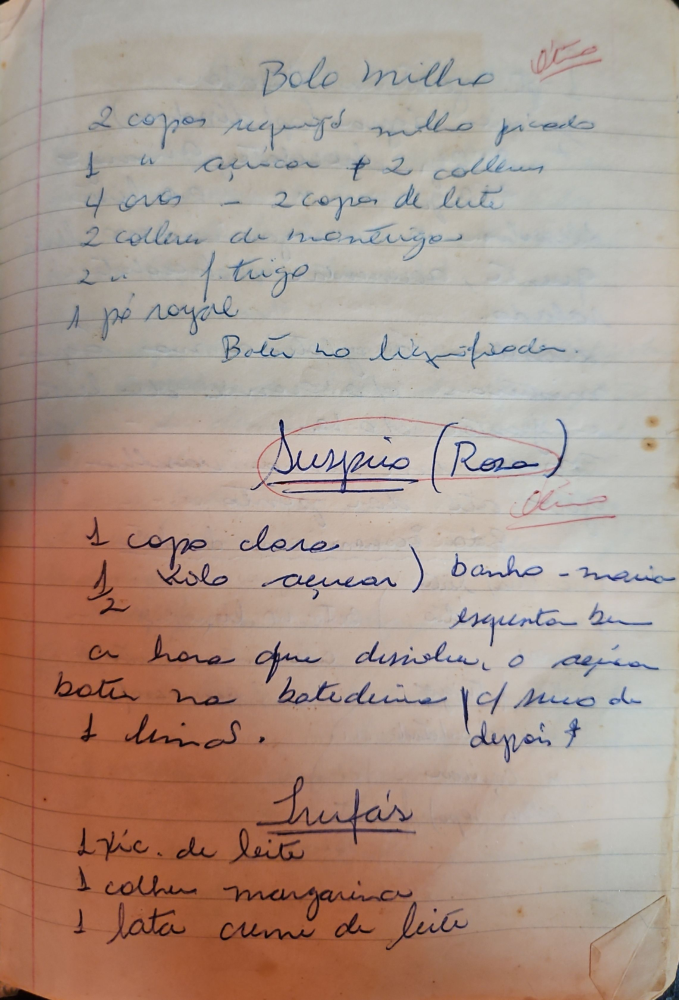

# Página 97
:::danger[NÃO REVISADO]
A página não foi revisada, portanto pode conter erros de digitação, formatação ou alucinações.
:::
## Bolo milho
- 2 copos requeijos milho picado
- 1 kg açucar + 2 colher
- 4 ovos - 2 copos de leite
- 2 colher de mantigos
- 2 colher de trigo
- 1 pó royal
- Bater no liquidificador.

## Suspiro (Rosa)
- 1 copo clara
- ½ kilo açucar) banho-maria
- esquenta bem
- a hora que disolver o açucar
- bater na batedeira c/ sum de
- 1 limos
- depois

## Trufás
- 1 xic. de leite
- 1 colher margarina
- 1 lata creme de leite

