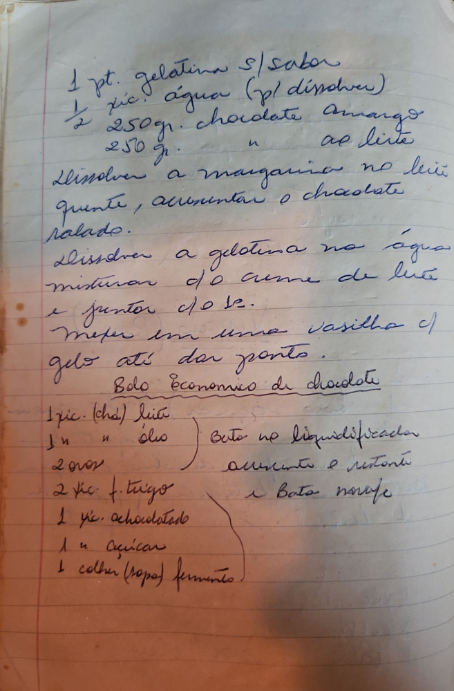

# Página 98
:::danger[NÃO REVISADO]
A página não foi revisada, portanto pode conter erros de digitação, formatação ou alucinações.
:::
1 pt. gelatina s/ sabor
½ xic. água (p/ dissolver)
250 gr. chocolate amargo
250 gr. chocolate ao leite

Dissolver a margarina no leite quente, acrescentar o chocolate ralado.
Dissolver a gelatina na água
misturar c/ o creme de leite e juntar c/ o ch.
Mexer em uma vasilha c/ gelo até dar ponto.

## Bolo Economico de chocolate

- 1 xic. (chá) leite
- 1 xic. óleo
- 2 ovos
- 2 xic. f. trigo
- 1 xic. achocolatado
- 1 xic. açúcar
- 1 colher (sopa) fermento

Bate no liquidificador (leite, óleo, ovos)
acrescenta o restante e Bate nove (trigo, achocolatado, açúcar, fermento)

