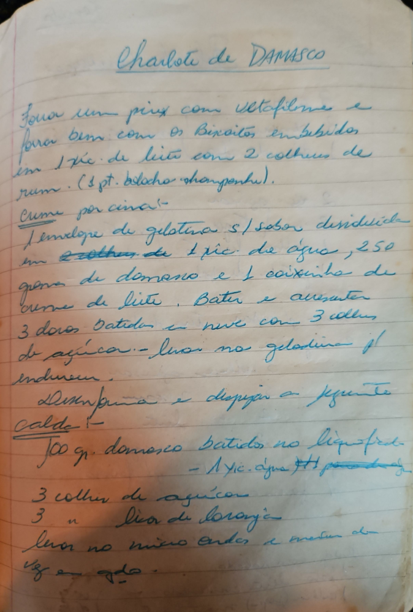

# Página 99
:::danger[NÃO REVISADO]
A página não foi revisada, portanto pode conter erros de digitação, formatação ou alucinações.
:::
## Charlotte de DAMASCO

Forra um pirex com celofane e forra bem com os biscoitos embebidos em 1 xíc. de leite com 2 colheres de rum. (1 pt. biscoito champagne).

### Creme por cima

- 1 envelope de gelatina s/ sabor dissolvida em 2 colheres de 1 xíc. de água, 250 gramas de damasco e 1 caixinha de creme de leite.
- Bater e acrescentar 3 claras batidas em neve com 3 colher de açúcar.
- Levar na geladeira p/ endurecer.

### Desenforma e despejar a seguinte

Calda:

- 100 gr. damasco batidos no liquidific.
- 1 xíc. água (já podada)
- 3 colher de açúcar
- 3 " " suco de laranja
- Levar no micro ondas e mexer de vez em qdo.

