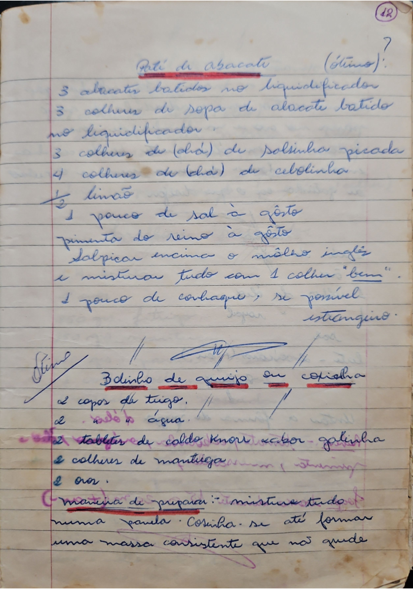

# Página 10
:::danger[NÃO REVISADO]
A página não foi revisada, portanto pode conter erros de digitação, formatação ou alucinações.
:::

## Patê de Abacate (Ótimo)

- 3 abacates batidos no liquidificador
- 3 colheres de sopa de abacate batido no liquidificador
- 3 colheres de (chá) de salsinha picada
- 4 colheres de (chá) de cebolinha
- ½ limão
- 1 pouco de sal à gôsto
- pimenta do reino à gôsto

Salpicar encima o môlho inglez
e misturar tudo com 1 colher "bem".
1 pouco de conhaque, se possível estrangeiro.

## Bolinho de queijo ou coxinha

- 2 copos de trigo.
- 2 tabletes de caldo Knorr sabor galinha
- 2 colheres de manteiga
- 2 ovos.

Maneira de preparo: mistura tudo
numa panela. Cozinha. se até formar
uma massa consistente que não grude

