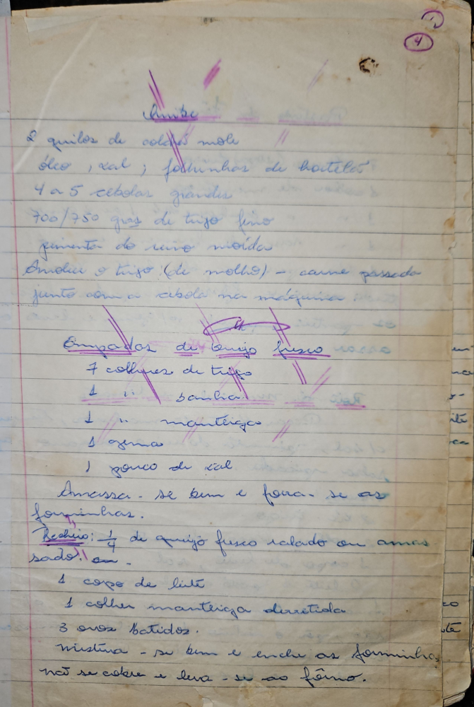

# Página 2
:::danger[NÃO REVISADO]
A página não foi revisada, portanto pode conter erros de digitação, formatação ou alucinações.
:::
## Quibe

- 2 quilos de carne mole
- óleo, sal; folhinhas de hortelã
- 4 a 5 cebolas grandes
- 700/750 grs de trigo fino
- pimenta do reino moidas
- Amolia o trigo (de molho) - carne passada
- junto com a cebola na máquina.

## Empadas de queijo fresco

- 7 colheres de trigo
- 1 " " banha
- 1 " " manteiga
- 1 gema
- 1 pouco de sal

Amassa-se bem e forra-se as forminhas.

### Recheio:

- ¼ de queijo fresco ralado ou amassado, ou -
- 1 copo de leite
- 1 colher manteiga derretida
- 3 ovos batidos.

Mistura-se bem e enche as forminhas. Não se cobre e leva-se ao fôrno.

