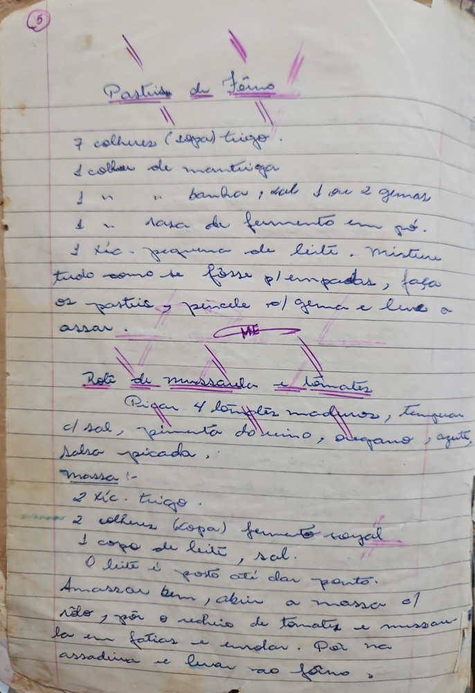

# Página 3
:::danger[NÃO REVISADO]
A página não foi revisada, portanto pode conter erros de digitação, formatação ou alucinações.
:::
## Pastéis de Fôrno

*   7 colheres (sopa) trigo.
*   1 colher de manteiga
*   1 colher banha, sal 1 ou 2 gemas
*   1 colher rala de fermento em pó.
*   1 xic. pequena de leite.
*   Misture tudo como se fosse p/ empadas, faça os pasteis, pincele c/ gema e leve a assar.

## Rolê de mussarela e tomates

### Recheio

*   Picar 4 tomates maduros, temperar c/ sal, pimenta do reino, oregano, azeite, salsa picada.

### Massa

*   2 xic. trigo.
*   2 colheres (sopa) fermento royal
*   1 copo de leite, sal.
*   O leite é posto até dar ponto.

### Modo de Preparo

*   Amassar bem, abrir a massa c/ rolo, por o recheio de tomate e mussa-
*   la em fatias e enrolar.
*   Por na assadeira e levar ao forno.

