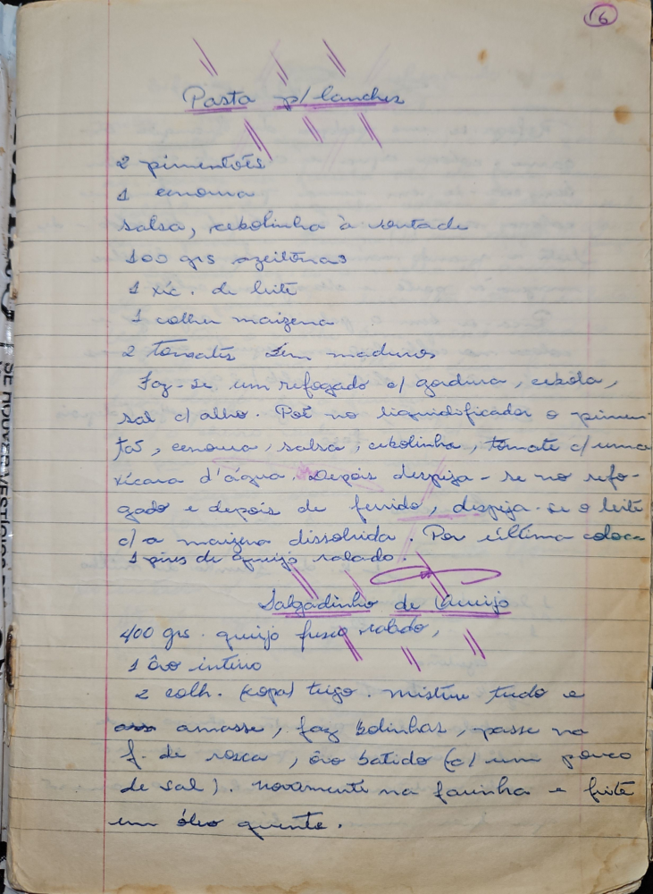

# Página 4
:::danger[NÃO REVISADO]
A página não foi revisada, portanto pode conter erros de digitação, formatação ou alucinações.
:::
## Pasta p/ lanches

- 2 pimentões
- 1 cebola
- salsa, cebolinha a vontade
- 300 grs azeitonas
- 1 xíc. de leite
- 1 colher maizena
- 2 tomates bem maduros

Faz-se um refogado c/ gordura, cebola, sal c/ alho. Põe no liquidificador o pimen-tão, cenoura, salsa, cebolinha, tomate c/ uma xícara d'água. Depois despeja-se no refogado e depois de fervido, despeja-se o leite c/ a maizena dissolvida. Por última colocar 2 pires de queijo ralado.

## Salgadinho de Queijo

- 400 grs queijo fresco ralado
- 1 ôvo inteiro
- 2 colh. sopa trigo

misture tudo e amasse, faz bolinhas, passe na f. de rosca, ôvo batido (c/ um pouco de sal). novamente na farinha e frite num óleo quente.

