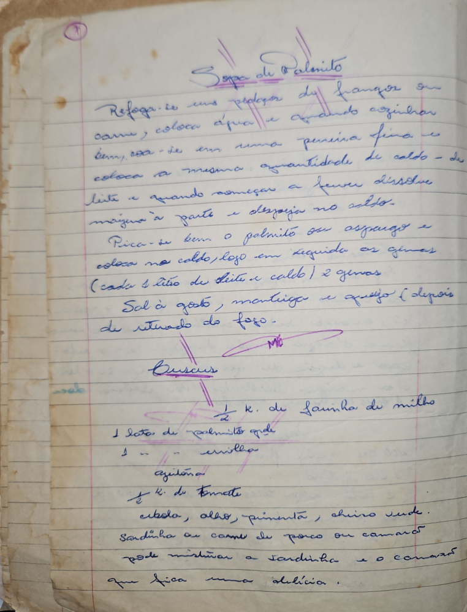

# Página 5
:::danger[NÃO REVISADO]
A página não foi revisada, portanto pode conter erros de digitação, formatação ou alucinações.
:::

## Sopa de Palmito

Refoga-se uns pedaços de frango ou carne, coloca água e quando cozinhar bem, coa-se em uma peneira fina e coloca a mesma quantidade de caldo - de leite e quando começar a ferver dissolve maizena a parte e despeja no caldo.

Pica-se bem o palmito ou aspargo e coloca no caldo, logo em seguida as gemas (cada litro de leite e caldo) 2 gemas

Sal a gosto, manteiga e queijo (depois de retirado do fogo.

Me

## Cuscuz

*   ½ k. de farinha de milho
*   1 lata de palmito ou
*   1 - ervilha
*   azeitona
*   ½ k. de tomate
*   cebola, alho, pimenta, cheiro verde.
*   Sardinha ou carne de porco ou camarão
*   pode misturar a sardinha e o camarão
*   que fica uma delícia.

