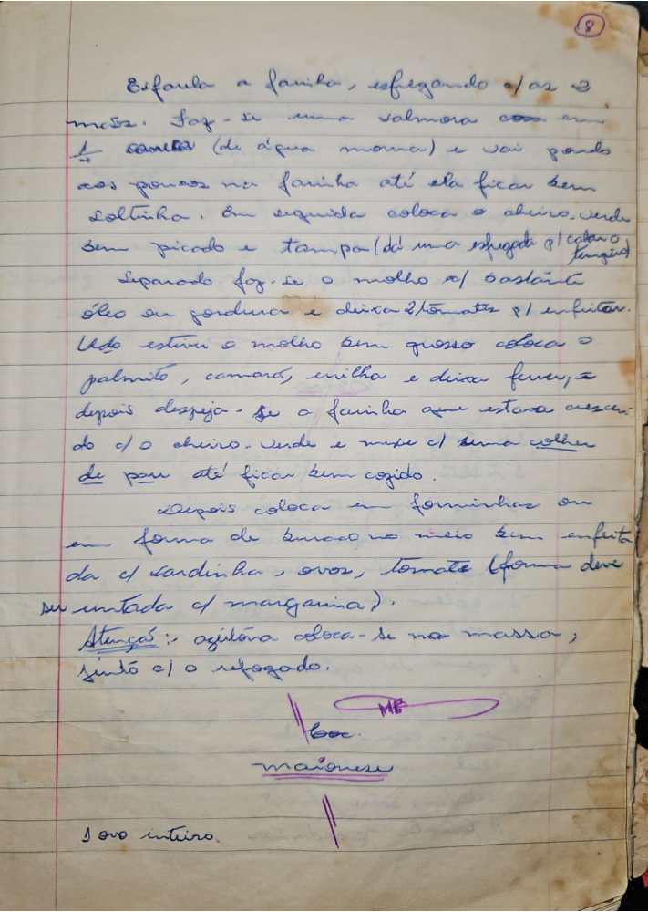

# Página 6
:::danger[NÃO REVISADO]
A página não foi revisada, portanto pode conter erros de digitação, formatação ou alucinações.
:::
## Massa

Esfarula a farinha, esfregando c/ os 2 mãos.
Faz-se uma salmora com 2 colheres (de água morna) e vai pondo aos poucos na farinha até ela ficar bem soltinha.
Em seguida coloca o cheiro-verde bem picado e um pouco.

## Molho

Separado faz-se o molho c/ bastante óleo ou gordura e deixa 2/3 tomates p/ enfritar.

## Combinação e Cozimento

Quando estiver o molho bem grosso coloca o palmito, camarão, ervilha e deixa ferver, e depois despeja-se a farinha que estava a crescer.
do c/ o cheiro. Verde e mexe c/ uma colher de pau até ficar bem cozido.

## Montagem e Decoração

Depois coloca em forminhas ou em forma de buraco no meio. Em enfeita da c/ sardinha, ovos, tomate (forma deve su untada c/ margarina).

## Atenção

azeitona coloca-se na massa, junto c/ o refogado.

## Notas / Ingredientes Adicionais

* boc.
* maionese
* 1 ovo inteiro.

