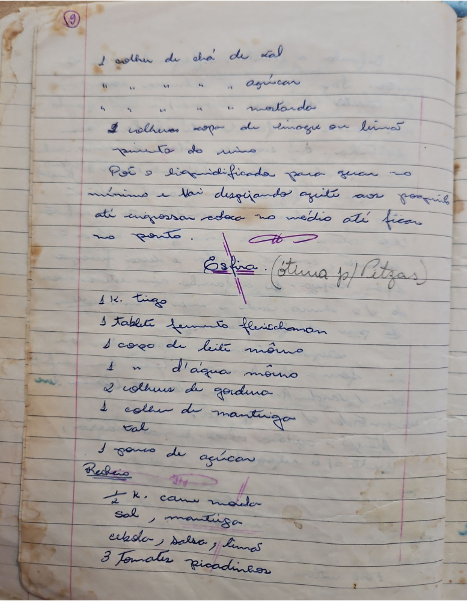

# Página 7
:::danger[NÃO REVISADO]
A página não foi revisada, portanto pode conter erros de digitação, formatação ou alucinações.
:::

## Maionese (ou Molho)

*   1 colher de chá de sal
*   Agúcar
*   Mostarda
*   2 colheres sopa de vinagre ou limão
*   pimenta do reino

Põe o liquidificador para girar no
minimo e vai despejando azeite aos poucos
até engrossar coloca no medio até ficar
no ponto.

## Esfina (Otima p/ Pizzas)

*   1 K. trigo
*   1 Tablete fermento fleischman
*   1 copo de leite morno
*   1 copo de d'água morna
*   2 colheres de gordura
*   1 colher de manteiga
*   sal
*   1 pouco de açúcar

### Recheio

*   ½ K. carne moída
*   sal, manteiga
*   cebola, salsa, limão
*   3 tomates picadinhos

