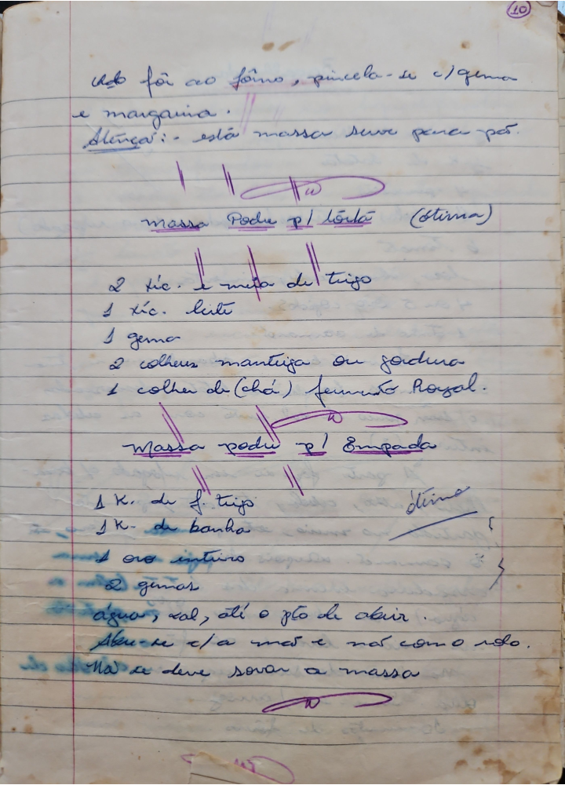

# Página 8
:::danger[NÃO REVISADO]
A página não foi revisada, portanto pode conter erros de digitação, formatação ou alucinações.
:::
Qdo foi ao forno, pincela-se c/gema e margarina.
Atenção: - esta massa deve pene-se por...

## Massa Podre p/ Torta (ótima)

*   2 xic. e meia de trigo
*   1 xic. leite
*   1 gema
*   2 colheres manteiga ou gordura
*   1 colher de (chá) fermento Royal.

## Massa podre p/ Empada (ótima)

*   1 K. de f. trigo
*   1 K. de banha
*   1 ovo inteiro
*   2 gemas
*   agua, sal, alé o pto de abrir.
*   Amace c/ a mão e não como o pão.
*   Não se deve sovar a massa.

