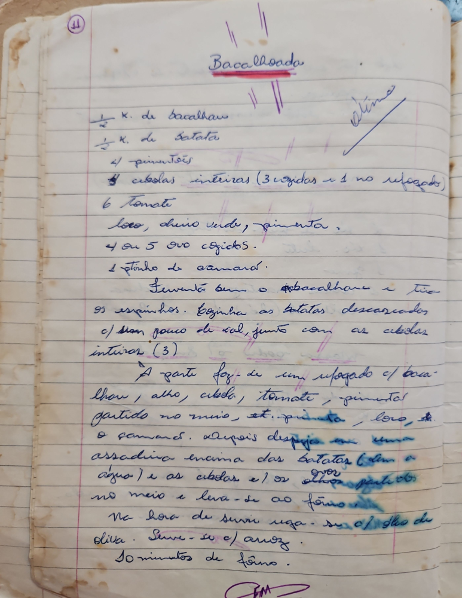

# Página 9
:::danger[NÃO REVISADO]
A página não foi revisada, portanto pode conter erros de digitação, formatação ou alucinações.
:::
## Bacalhoado

-   ½ K. de bacalhau
-   ½ K. de Batata
-   4 pimentões
-   4 cebolas inteiras (3 cozidas e 1 no refogado)
-   6 Tomate
-   Louro, cheiro verde, pimenta
-   4 ou 5 ovo cozidos.
-   1 finho de camarão.

-   Fermenta bem o bacalhau e tira as espinhas. Cozinha as batatas descascadas c/ um pouco de sal, junto com as cebolas inteiras (3)
-   À parte faz-se um refogado c/ bacalhau, alho, cebola, tomate, pimentão partido no meio, et. pimenta, louro, et. o camarão.
-   Depois dispõem em uma assadeira encima das batatas (sem a água) e as cebolas e os alhos partidos no meio e leva-se ao fôrno.
-   Na hora de servir rega-se c/ óleo de oliva. Serve-se c/ arroz.
-   10 minutos de fôrno.

