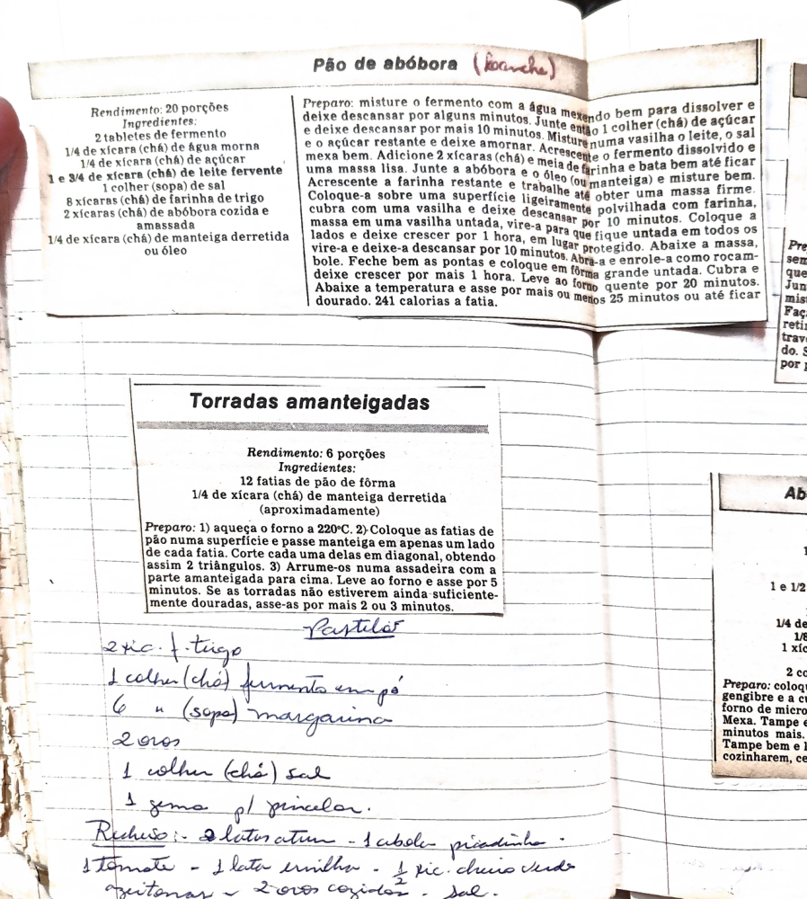

# Página 101
:::danger[NÃO REVISADO]
A página não foi revisada, portanto pode conter erros de digitação, formatação ou alucinações.
:::

## Pão de abóbora (lanche)

### Rendimento: 20 porções

### Ingredientes:

*   2 tabletes de fermento
*   1/4 de xícara (chá) de água morna
*   1/4 de xícara (chá) de açúcar
*   1 e 3/4 de xícara (chá) de leite fervente
*   1 colher (sopa) de sal
*   8 xícaras (chá) de farinha de trigo
*   2 xícaras (chá) de abóbora cozida e amassada
*   1/4 de xícara (chá) de manteiga derretida ou óleo

### Preparo:

1.  Misture o fermento com a água mexendo bem para dissolver e deixe descansar por alguns minutos.
2.  Junte então 1 colher (chá) de açúcar e deixe descansar por mais 10 minutos.
3.  Misture numa vasilha o leite, o sal e o açúcar restante e deixe amornar.
4.  Acrescente o fermento dissolvido e mexa bem.
5.  Adicione 2 xícaras (chá) e meia de farinha e bata bem até ficar uma massa lisa.
6.  Junte a abóbora e o óleo (ou manteiga) e misture bem.
7.  Acrescente a farinha restante e trabalhe até obter uma massa firme.
8.  Coloque-a sobre uma superfície ligeiramente polvilhada com farinha e deixe descansar por 10 minutos.
9.  Coloque a massa em uma vasilha untada, vire-a para que fique untada em todos os lados e deixe crescer por 1 hora, em lugar protegido.
10. Abaixe a massa, vire-a e deixe-a descansar por 10 minutos.
11. Abra-a e enrole-a como rocambole.
12. Feche bem as pontas e coloque em fôrma grande untada.
13. Cubra e deixe crescer por mais 1 hora.
14. Leve ao forno quente por 20 minutos.
15. Abaixe a temperatura e asse por mais ou menos 25 minutos ou até ficar dourado.
16. 241 calorias a fatia.

---

## Torradas amanteigadas

### Rendimento: 6 porções

### Ingredientes:

*   12 fatias de pão de fôrma
*   1/4 de xícara (chá) de manteiga derretida (aproximadamente)

### Preparo:

1.  Aqueça o forno a 220°C.
2.  Coloque as fatias de pão numa superfície e passe manteiga em apenas um lado de cada fatia.
3.  Corte cada uma delas em diagonal, obtendo assim 2 triângulos.
4.  Arrume-os numa assadeira com a parte amanteigada para cima.
5.  Leve ao forno e asse por 5 minutos.
6.  Se as torradas não estiverem ainda suficientemente douradas, asse-as por mais 2 ou 3 minutos.

---

## Pastelão (handwritten)

### Ingredientes:

*   2 xic. f. trigo
*   1 colher (chá) fermento em pó
*   6 colher (sopa) margarina
*   2 ovos
*   1 colher (chá) sal
*   1 gema p/ pincelar

### Recheio:

*   2 latas atum
*   1 cebola picadinha
*   1 tomate
*   1 lata ervilha
*   1/2 xic. cheiro verde
*   Azeitonas
*   2 ovos cozidos
*   Sal

