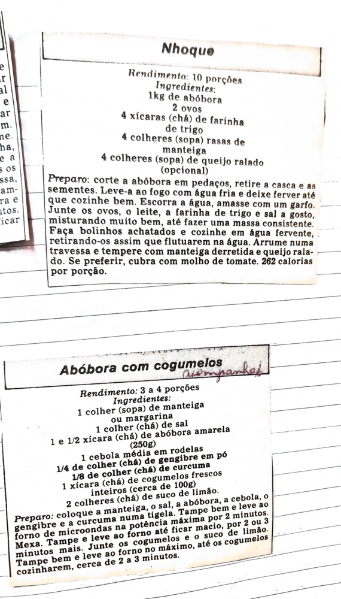

# Página 102
:::danger[NÃO REVISADO]
A página não foi revisada, portanto pode conter erros de digitação, formatação ou alucinações.
:::
## Nhoque

### Rendimento
10 porções

### Ingredientes
- 1kg de abóbora
- 2 ovos
- 4 xícaras (chá) de farinha de trigo
- 4 colheres (sopa) rasas de manteiga
- 4 colheres (sopa) de queijo ralado (opcional)

### Preparo
- corte a abóbora em pedaços, retire a casca e as sementes.
- Leve-a ao fogo com água fria e deixe ferver até que cozinhe bem.
- Escorra a água, amasse com um garfo.
- Junte os ovos, o leite, a farinha de trigo e sal a gosto, misturando muito bem, até fazer uma massa consistente.
- Faça bolinhos achatados e cozinhe em água fervente, retirando-os assim que flutuarem na água.
- Arrume numa travessa e tempere com manteiga derretida e queijo ralado.
- Se preferir, cubra com molho de tomate.
- 262 calorias por porção.

## Abóbora com cogumelos

### Rendimento
3 a 4 porções

### Ingredientes
- 1 colher (sopa) de manteiga ou margarina
- 1 colher (chá) de sal
- 1 e 1/2 xícara (chá) de abóbora amarela (250g)
- 1 cebola média em rodelas
- 1/4 de colher (chá) de gengibre em pó
- 1/8 de colher (chá) de curcuma
- 1 xícara (chá) de cogumelos frescos inteiros (cerca de 100g)
- 2 colheres (chá) de suco de limão.

### Preparo
- Coloque a manteiga, o sal, a abóbora, a cebola, o gengibre e a curcuma numa tigela.
- Tampe bem e leve ao forno de microondas na potência máxima por 2 minutos.
- Mexa.
- Tampe e leve ao forno até ficar macio, por 2 ou 3 minutos mais.
- Junte os cogumelos e o suco de limão.
- Tampe bem e leve ao forno no máximo, até os cogumelos cozinharem, cerca de 2 a 3 minutos.

