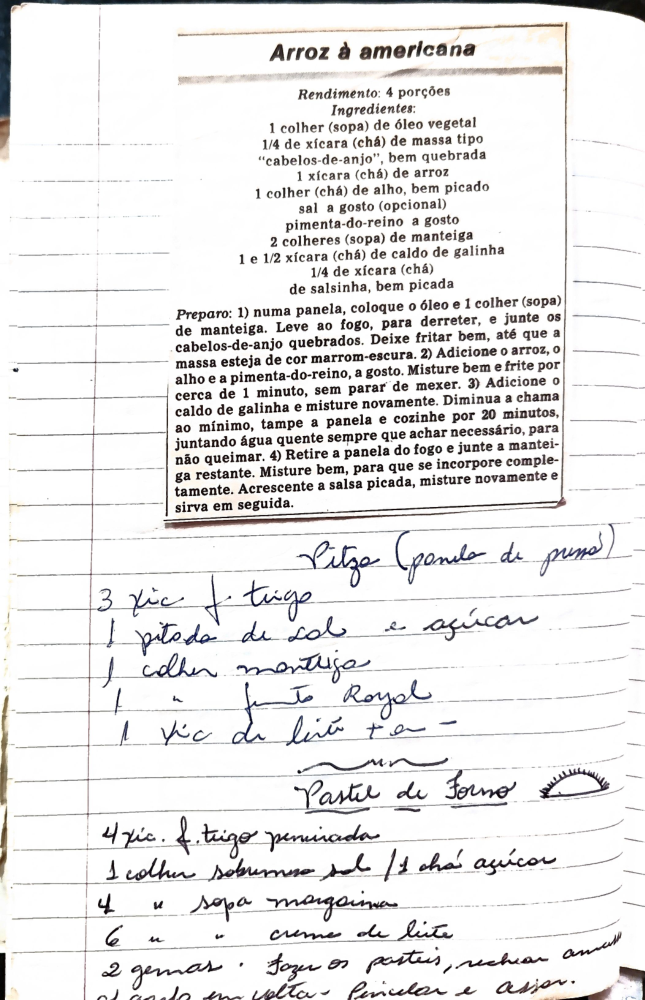

# Página 103
:::danger[NÃO REVISADO]
A página não foi revisada, portanto pode conter erros de digitação, formatação ou alucinações.
:::
## Arroz à americana

### Rendimento: 4 porções

### Ingredientes:

- 1 colher (sopa) de óleo vegetal
- 1/4 de xícara (chá) de massa tipo "cabelos-de-anjo", bem quebrada
- 1 xícara (chá) de arroz
- 1 colher (chá) de alho, bem picado
- sal a gosto (opcional)
- pimenta-do-reino a gosto
- 2 colheres (sopa) de manteiga
- 1 e 1/2 xícara (chá) de caldo de galinha
- 1/4 de xícara (chá) de salsinha, bem picada

### Preparo:

1. numa panela, coloque o óleo e 1 colher (sopa) de manteiga. Leve ao fogo, para derreter, e junte os cabelos-de-anjo quebrados. Deixe fritar bem, até que a massa esteja de cor marrom-escura.
2. Adicione o arroz, o alho e a pimenta-do-reino, a gosto. Misture bem e frite por cerca de 1 minuto, sem parar de mexer.
3. Adicione o caldo de galinha e misture novamente. Diminua a chama ao mínimo, tampe a panela e cozinhe por 20 minutos, juntando água quente sempre que achar necessário, para não queimar.
4. Retire a panela do fogo e junte a manteiga restante. Misture bem, para que se incorpore completamente. Acrescente a salsinha picada, misture novamente e sirva em seguida.

## Pitza (panela de pressão)

### Ingredientes:

- 3 xic. f. trigo
- 1 pitada de sal e açúcar
- 1 colher manteiga
- 1 " " fermento Royal
- 1 xic de leite + a -

## Pastel de Forno

### Ingredientes:

- 4 xic. f. trigo peneirada
- 1 colher sobremesa sal / 1 chá açúcar
- 4 " " sopa margarina
- 6 " " " creme de leite
- 2 gemas

### Preparo:

- Fazer os pasteis, rechear amassar o gando em volta. Pincelar e assar.

