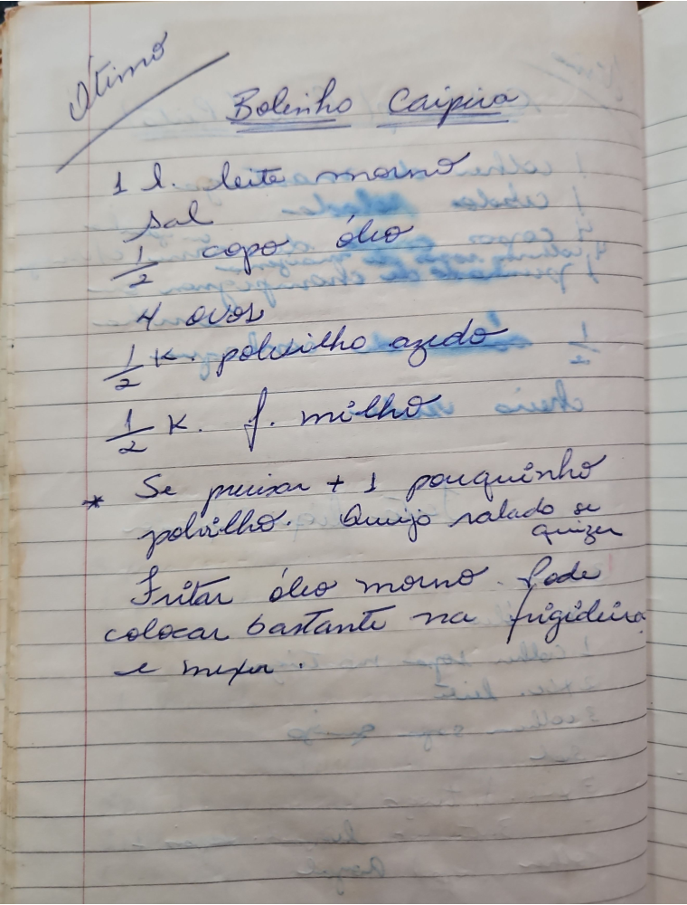

# Página 104
:::danger[NÃO REVISADO]
A página não foi revisada, portanto pode conter erros de digitação, formatação ou alucinações.
:::
## Bolinho Caipira

- 1 l. leite morno
- Sal
- ½ copo óleo
- 4 ovos
- ½ K. polvilho azedo
- ½ K. f. milho

* Se precisar + 1 pouquinho polvilho. Queijo ralado se quiser
- Fritar óleo morno - Pode colocar bastante na frigideira e mexer.

