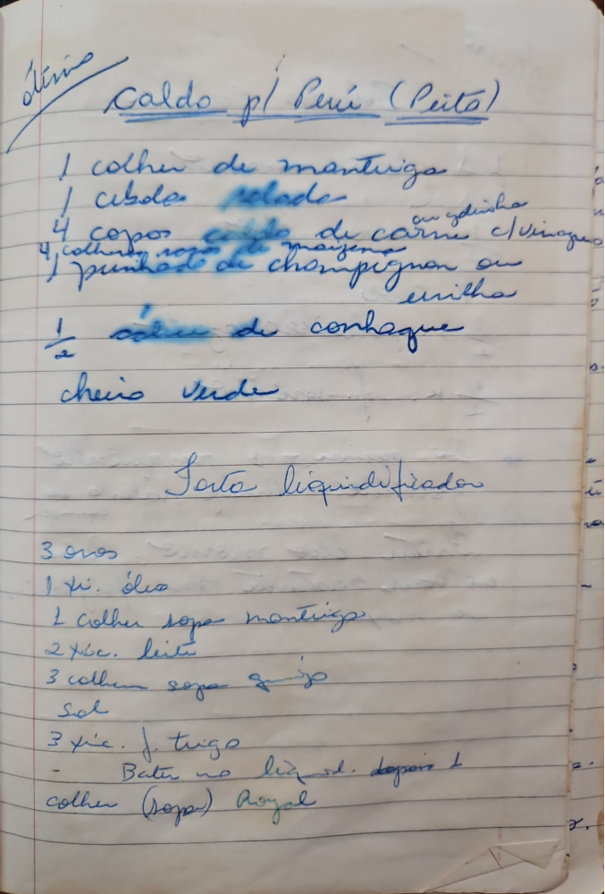

# Página 105
:::danger[NÃO REVISADO]
A página não foi revisada, portanto pode conter erros de digitação, formatação ou alucinações.
:::

## Caldo pl Perú (Peito)

- 1 colher de mantriga
- 1 cebola ralada ou picadinha
- 4 copos caldo de carne c/ vinagre
- 4 colher (sopa) de maisena
- 1 punhado de champignon ou ervilha
- 1/2 colher de conhaque
- cheiro verde

## Bolo liquidificador

- 3 ovos
- 1 xc. óleo
- 1 colher sopa mantriga
- 2 xc. leite
- 3 colher sopa queijo
- Sal
- 3 xc. f trigo
- Bater no liq id. depois 1
- colher (Sopa) Royal

