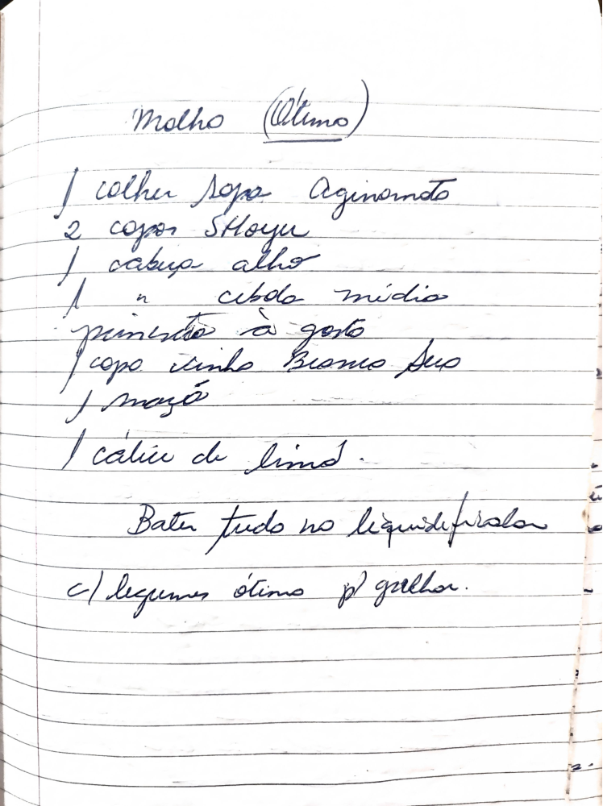

# Página 106
:::danger[NÃO REVISADO]
A página não foi revisada, portanto pode conter erros de digitação, formatação ou alucinações.
:::
## Molho (Ótimo)

*   1 colher sopa Aginomoto
*   2 copo Shou
*   1 cabeça alho
*   1 " cebola média
*   pimenta à gosto
*   1 copo vinho Branco Seco
*   1 maçã
*   1 cálice de limão

Bater tudo no liquidificador.

c/ legumes ótimo p/ galinha.

