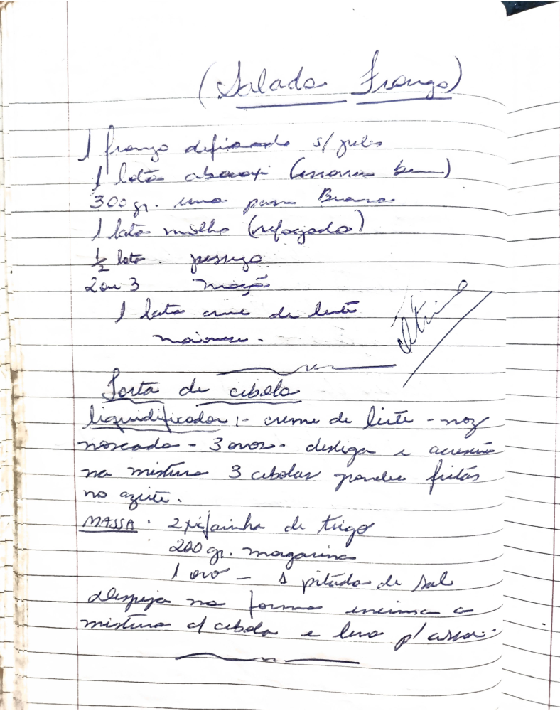

# Página 107
:::danger[NÃO REVISADO]
A página não foi revisada, portanto pode conter erros de digitação, formatação ou alucinações.
:::
## Receitas

### Salada Frango

-   1 frango desfiado s/jules
-   1 lata abacaxi (enxágue bem)
-   300 gr. uva passa branca
-   1 lata milho (refogado)
-   ½ lata pepino
-   2 ou 3 maçãs
-   1 lata creme de leite
-   maionese

### Torta de Cebola

#### Recheio

-   No liquidificador:
    -   1 - creme de leite
    -   noz moscada
    -   3 ovos
-   despeja e adicione na mistura
-   3 cebolas grandes fritas no azeite.

#### Massa

-   2 ½ xícara de trigo
-   200 gr. margarina
-   1 ovo
-   1 pitada de sal

#### Montagem e Cozimento

-   Despeja na forma untada a mistura de cebola e leva p/ assar.

