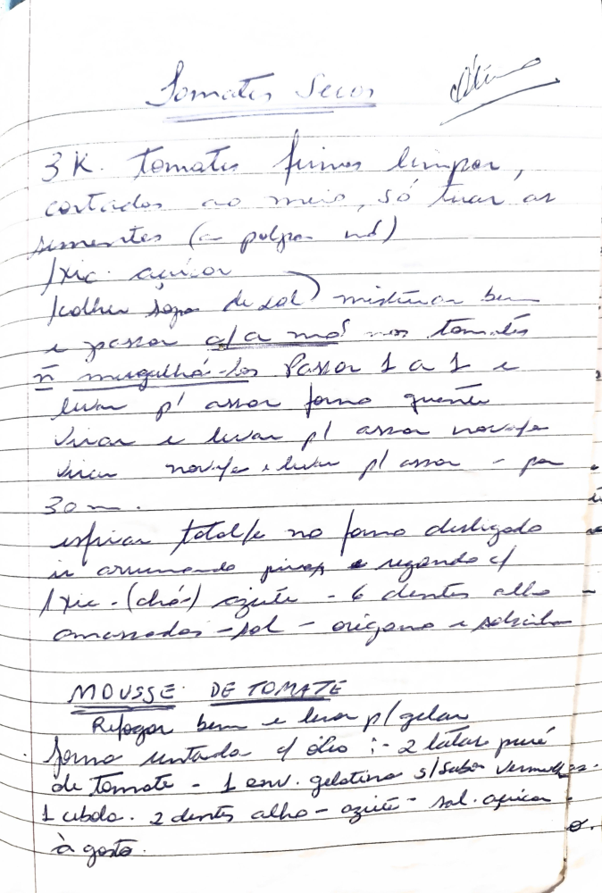

# Página 108
:::danger[NÃO REVISADO]
A página não foi revisada, portanto pode conter erros de digitação, formatação ou alucinações.
:::
## Tomates Secos (Otto)

*   3 K. Tomates firmes, limpar,
*   cortados ao meio, só tirar as
*   sementes (a polpa não)
*   Friccionar
*   1 colher sopa de sal) misturar bem
*   e passar c/a mão nos tomates
*   não mugulhá-los. Passar 1 a 1 e
*   levar p/ assar forno quente
*   Virar e levar p/ assar novafte
*   bem novafte e levar pl assar - por
*   30m.
*   esfriar totalfe no forno desligado
*   is arrumado piores e regando c/
*   1 xic. (chá) azeite - 6 dentes alho
*   amassados - sal - oregano e pimenta
*   a gosto.

## MOUSSE DE TOMATE

*   Refogar bem e levar p/ gelan
*   forno untado c/ olis
*   2 latas puré
*   de Tomate - 1 env. gelatina s/sabor vermellas.
*   1 cebola. 2 dentes alho - azeite - sal - pimenta
*   a gosto.

