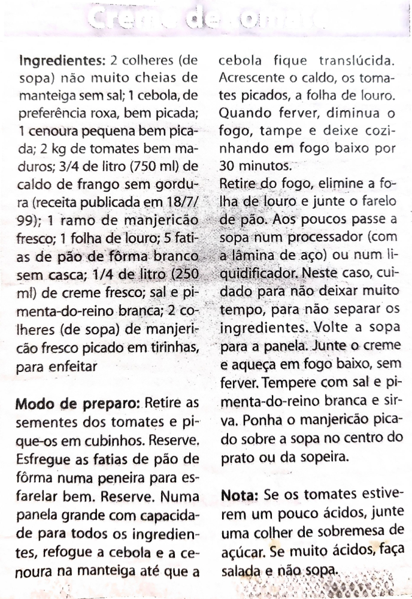

# Página 109
:::danger[NÃO REVISADO]
A página não foi revisada, portanto pode conter erros de digitação, formatação ou alucinações.
:::
Creme de Tomate

## Ingredientes

- 2 colheres (de sopa) não muito cheias de manteiga sem sal
- 1 cebola, de preferência roxa, bem picada
- 1 cenoura pequena bem picada
- 2 kg de tomates bem maduros
- 3/4 de litro (750 ml) de caldo de frango sem gordura (receita publicada em 18/7/99)
- 1 ramo de manjericão fresco
- 1 folha de louro
- 5 fatias de pão de fôrma branco sem casca
- 1/4 de litro (250 ml) de creme fresco
- sal e pimenta-do-reino branca
- 2 colheres (de sopa) de manjericão fresco picado em tirinhas, para enfeitar

## Modo de preparo

Retire as sementes dos tomates e pique-os em cubinhos. Reserve. Esfregue as fatias de pão de fôrma numa peneira para esfarelar bem. Reserve. Numa panela grande com capacidade para todos os ingredientes, refogue a cebola e a cenoura na manteiga até que a cebola fique translúcida. Acrescente o caldo, os tomates picados, a folha de louro. Quando ferver, diminua o fogo, tampe e deixe cozinhando em fogo baixo por 30 minutos.

Retire do fogo, elimine a folha de louro e junte o farelo de pão. Aos poucos passe a sopa num processador (com a lâmina de aço) ou num liquidificador. Neste caso, cuidado para não deixar muito tempo, para não separar os ingredientes. Volte a sopa para a panela. Junte o creme e aqueça em fogo baixo, sem ferver. Tempere com sal e pimenta-do-reino branca e sirva. Ponha o manjericão picado sobre a sopa no centro do prato ou da sopeira.

## Nota

Se os tomates estiverem um pouco ácidos, junte uma colher de sobremesa de açúcar. Se muito ácidos, faça salada e não sopa.

