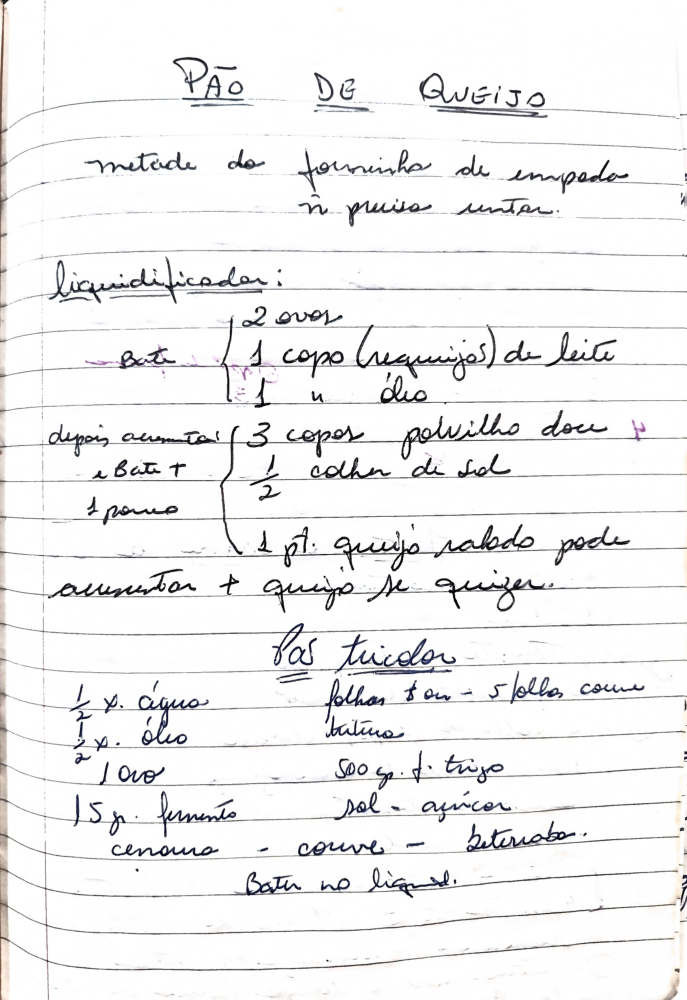

# Página 110
:::danger[NÃO REVISADO]
A página não foi revisada, portanto pode conter erros de digitação, formatação ou alucinações.
:::
## PÃO DE QUEIJO

metade da forminha de empada
não precisa untar.

### Liquidificador

Bate:
*   2 ovos
*   1 copo (requeijão) de leite
*   1 dedo de óleo

depois aumenta:
*   3 copos polvilho doce
*   1/2 colher de sal
*   e Bate + 1 pouco

1 pt. queijo ralado pode aumentar + queijo se quiser.

## Pão tricolor

*   1/2 x. água
*   1/2 x. óleo
*   2 ovos
*   15gr. fermento
*   cenoura - couve - beterraba
*   500g. f. trigo
*   sal - açúcar

*   folhas ou - 5 folhas couve batidas
*   Bater no liquidificador

